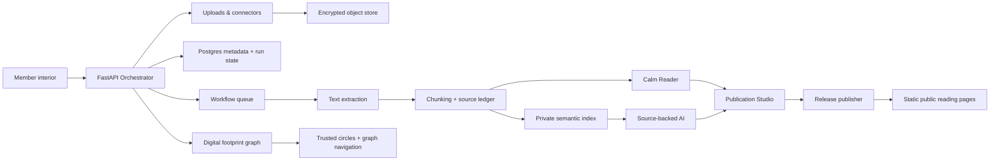

# Knowledge & Publication OS

> The next product foundation after the profile/invite surface: a calm place where members
> bring their own documents and connected sources, read deeply, summarize responsibly, and
> publish durable work without surrendering attention or ownership.

## 1. North star

Stay is the alternative calmer internet: not a feed, not a social graph for extraction,
but a member-owned knowledge home.

Members can:

- Upload documents, notes, drafts, PDFs, EPUBs, images, transcripts, and research files.
- Connect source accounts deliberately, such as social media exports, newsletters, cloud drives, GitHub, or personal sites.
- Read in a focused reader with citation-aware summaries and source trails.
- Ask AI questions over their own knowledge without the system pretending unsourced answers are facts.
- Manage what is private, shared, archived, deleted, or published.
- Publish long-form work, including books, essays, living manuals, and collections.

## 2. What this is not

- Not an engagement feed.
- Not a public vanity metric system.
- Not a scraper that silently vacuums data.
- Not a chatbot that trains on member data by default.
- Not a publishing platform optimized for virality.

## 3. Product primitives

### K1 — Knowledge Vault

The private source library. Each item has owner, provenance, permissions, source type,
processing status, and deletion/export controls.

Supported first sources:

- Manual upload: PDF, markdown, text, docx/epub later.
- Native writing: notes, essays, book chapters.
- URL capture: saved page with readable extraction and source snapshot.

Later connectors:

- GitHub repos/issues/PRs.
- Google Drive/Dropbox/iCloud-style document sources.
- Social media exports or API connectors where allowed.
- Newsletter/mailbox imports via explicit filters.

### K2 — Source Ledger

Every fact, summary, quote, and AI answer points back to the original source chunk. No
uncited synthesis is treated as knowledge.

Required metadata:

- `source_id`, `owner_id`, `origin`, `import_method`, `created_at`, `processed_at`.
- `visibility`: private, shared-with-invite, public, archived.
- `rights`: owned, licensed, external reference, unknown.
- `retention`: keep, auto-archive, delete-after.

### K3 — Calm Reader

The reading surface becomes the primary interface, not a feed. It supports:

- Focused reading.
- Bionic/guided reading.
- Summaries at document, chapter, and passage level.
- Highlights and anchors that become knowledge nodes.
- Natural end states and quiet next steps.

### K4 — AI Knowledge Assistant

AI works only inside explicit scope:

- Answer from selected sources.
- Summarize with citations.
- Compare documents.
- Extract claims, definitions, timelines, people, projects, tasks.
- Create study notes, outlines, and publication drafts.

Default rule: if sources do not support an answer, the assistant says so.

### K5 — Publication Studio

The place to publish your book and future member work.

Core units:

- Book project.
- Part / chapter / section.
- Draft revisions.
- Editorial notes.
- Source-backed citations.
- Public reading page.
- Export targets: web, PDF, EPUB later.

The first real customer delivery is Habte's profile plus book/publication workspace.

### K6 — Digital Footprint Graph

The member-owned graph of identities, platform accounts, sources, publications, posts,
topics, projects, people, organizations, and trusted circles.

The graph answers:

- where a member's public and private work lives;
- how posts, sources, projects, and claims connect;
- what came from Substack, Bluesky, Mastodon, GitHub, RSS, uploads, or manual archives;
- which identities are explicitly linked through `same_as`;
- which nodes are public, private, shared, stale, revoked, or manually verified.

The detailed integration and graph-navigation spec lives in
`07-DIGITAL-FOOTPRINT-GRAPH.md`.

## 3A. Product UI decisions from the AI Platform review

The existing AI Platform React layers contain useful patterns for the first DOT scaffold,
but the product language and attention model must change.

### Publication Studio

Use a split workspace, not a dashboard:

- Left rail: project outline, parts, chapters, source collections.
- Center: section editor or Calm Reader preview.
- Right inspector: citations, claim support, release validation, run status, revision
  history, and export.

The workspace should support deep writing sessions. Avoid KPI cards, broad admin panels,
activity feeds, and notification rails.

### Knowledge Vault

Use a guided source intake flow:

1. Choose source: upload, paste text, URL capture, or later connector.
2. Declare scope: private, shared by invite, publication source, or archive-only.
3. Check: file type, size, readability, rights, duplicate detection, and safety concerns.
4. Review: show a plain-language recommendation before ingestion.
5. Process: background run with clear status and retry/cancel affordances.
6. Done: open in reader, add to project, ask over this source, or export/delete.

This should be personal and rights-aware, not enterprise governance language.

### Source Assistant

The assistant is a panel inside a task, not the default home screen. It must always show
its active scope: selected source, selected collection, selected project, or selected
release. Unsupported answers are explicit, and cited answers use source anchor chips.

### Citation UI

Inline citation chips should open source previews with title, excerpt, locator, confidence
or reliability, and link-to-source/read-position actions. The UI should make provenance
visible without turning reading into a debugging console.

### Footprint Graph

The footprint graph is the primary navigation surface for digital identity and the future
social platform. It shows identities, platforms, sources, posts, topics, projects, people,
and circles as connected nodes. It must remain member-controlled: no opaque feed ranking,
no inferred public identity merge without consent, and no graph edges that cannot point
back to provenance.

## 4. Architecture slice



The detailed service contract for this slice lives in `05-FASTAPI-ORCHESTRATOR.md`.
Implementation starts as a FastAPI service with durable workflow runs, Postgres/pgvector,
Redis-backed workers, encrypted object storage, and a static release publisher.

Target orchestrator modules:

- `sources`: uploads, connectors, source metadata, permissions.
- `ingestion`: extraction, chunking, OCR later, background processing.
- `knowledge`: chunks, embeddings, source ledger, citations.
- `assistant`: scoped retrieval, summaries, question answering.
- `publication`: books, chapters, revisions, public pages, exports.
- `graph`: footprint accounts, graph nodes, graph edges, graph imports/status, graph
  snapshots, identity links.
- `connectors`: Substack/RSS, Bluesky/AT Protocol, Mastodon/ActivityPub, GitHub, and
  future platform adapters.
- `runs`: workflow state, idempotency, retries, cancellation.
- `export_delete`: data export, deletion, retention, and key cleanup.
- `audit`: member-visible event ledger without private content.

## 5. Data model sketch

```text
knowledge_sources
  id, owner_id, title, source_type, origin_uri, visibility, rights_status,
  import_method, object_key, encryption_key_id, created_at, processed_at, deleted_at

knowledge_chunks
  id, source_id, owner_id, sequence, text_ciphertext_ref, locator, token_count,
  checksum, created_at

knowledge_embeddings
  chunk_id, owner_id, embedding_model, vector, created_at

knowledge_annotations
  id, owner_id, source_id, chunk_id, kind, body, created_at

publication_projects
  id, owner_id, type, title, slug, status, visibility, created_at, updated_at

publication_sections
  id, project_id, parent_id, order, title, body_ref, status, created_at, updated_at

publication_revisions
  id, section_id, editor_id, body_ref, message, created_at

publication_releases
  id, project_id, version, slug, status, manifest_key, rendered_at,
  published_at, revoked_at

orchestrator_runs
  id, owner_id, workflow_type, status, idempotency_key, input_ref,
  output_ref, error_code, created_at, started_at, completed_at

footprint_accounts
  id, owner_id, platform, handle, profile_url, auth_mode, status,
  sync_cursor, last_synced_at, revoked_at

footprint_nodes
  id, owner_id, kind, label, platform, external_id, source_ref, properties,
  visibility, confidence, first_seen_at, last_seen_at

footprint_edges
  id, owner_id, source_node_id, target_node_id, relation, platform,
  weight, confidence, evidence_ref, first_seen_at, last_seen_at

footprint_imports
  id, owner_id, account_id, run_id, connector, import_mode, status,
  requested_by, source_ref, summary, created_at, completed_at
```

## 6. Priority order

### Priority 1 — Profile readability and foundation polish

The first customer page must be readable and calm before adding more product power.

### Priority 2 — Publication Studio MVP for Habte's book

Build a private book project editor and public reading route backed by the FastAPI
orchestrator. Publication is the first full end-to-end workflow because it proves the
system can move from private draft to immutable public release.

MVP:

- Book landing page.
- Chapter list.
- Markdown/MDX chapter body.
- Draft/published status.
- Public read route.
- Export-friendly structure.
- Release manifest written to object storage/CDN.
- Orchestrator run status for validation and publish jobs.

### Priority 3 — Knowledge Vault upload MVP

Manual uploads first. Avoid connectors until source ownership, deletion, rate limits, and
permissions are designed properly.

MVP:

- Upload source.
- Extract text.
- Show processing status.
- Read source in Calm Reader.
- Delete/export source.
- Create source ledger anchors for future citations.

### Priority 4 — Source-backed AI summaries

Summaries and Q&A only after provenance is in place.

MVP:

- Summarize one source.
- Summarize a collection.
- Ask a question over selected sources.
- Return citations/source anchors.

### Priority 5 — Connectors

Add social/cloud connectors only after upload + publication + source ledger are reliable.
Connectors should be explicit, revocable, scoped, and inspectable.

## 7. End-to-end operating model

The system has five durable loops:

1. **Ingest:** member adds a source, the orchestrator stores it, extracts text, chunks it,
   embeds it, and records provenance.
2. **Read:** the Calm Reader opens a source or chapter with annotations and source anchors,
   without feed rails or engagement loops.
3. **Assist:** the AI assistant answers or summarizes only over selected sources and
   returns citations or unsupported-claim markers.
4. **Publish:** the Publication Studio validates a project, freezes a release, renders
   public assets, and serves them from the CDN.
5. **Leave:** export/delete workflows package or remove member data without staff
   intervention.

## 8. Manifesto mapping

- L2 Natural completion: reading and publishing have clear ends.
- L3 No feed: knowledge is sought, organized, and authored.
- L4 Pull not push: no notification-driven reading loops.
- L7 Reversible and honest: export/delete/manage sources.
- L8 Time-well-spent: the system helps finish reading/writing.
- L9 No surveillance: member data remains member-owned.
- L10 Single focus: one reading or writing task at a time.
- L12 Serve declared intention: AI works inside chosen sources.
