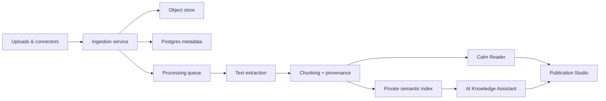

# Knowledge & Publication OS

> The next product foundation after the profile/invite surface: a calm place where members
> bring their own documents and connected sources, read deeply, summarize responsibly, and
> publish durable work without surrendering attention or ownership.

## 1. North star

Stay is the alternative calmer internet: not a feed, not a social graph for extraction,
but a member-owned knowledge home.

Members can:

- Upload documents, notes, drafts, PDFs, EPUBs, images, transcripts, and research files.
- Connect source accounts deliberately, such as social media exports, newsletters, cloud drives, GitHub, or personal sites.
- Read in a focused reader with citation-aware summaries and source trails.
- Ask AI questions over their own knowledge without the system pretending unsourced answers are facts.
- Manage what is private, shared, archived, deleted, or published.
- Publish long-form work, including books, essays, living manuals, and collections.

## 2. What this is not

- Not an engagement feed.
- Not a public vanity metric system.
- Not a scraper that silently vacuums data.
- Not a chatbot that trains on member data by default.
- Not a publishing platform optimized for virality.

## 3. Product primitives

### K1 — Knowledge Vault

The private source library. Each item has owner, provenance, permissions, source type,
processing status, and deletion/export controls.

Supported first sources:

- Manual upload: PDF, markdown, text, docx/epub later.
- Native writing: notes, essays, book chapters.
- URL capture: saved page with readable extraction and source snapshot.

Later connectors:

- GitHub repos/issues/PRs.
- Google Drive/Dropbox/iCloud-style document sources.
- Social media exports or API connectors where allowed.
- Newsletter/mailbox imports via explicit filters.

### K2 — Source Ledger

Every fact, summary, quote, and AI answer points back to the original source chunk. No
uncited synthesis is treated as knowledge.

Required metadata:

- `source_id`, `owner_id`, `origin`, `import_method`, `created_at`, `processed_at`.
- `visibility`: private, shared-with-invite, public, archived.
- `rights`: owned, licensed, external reference, unknown.
- `retention`: keep, auto-archive, delete-after.

### K3 — Calm Reader

The reading surface becomes the primary interface, not a feed. It supports:

- Focused reading.
- Bionic/guided reading.
- Summaries at document, chapter, and passage level.
- Highlights and anchors that become knowledge nodes.
- Natural end states and quiet next steps.

### K4 — AI Knowledge Assistant

AI works only inside explicit scope:

- Answer from selected sources.
- Summarize with citations.
- Compare documents.
- Extract claims, definitions, timelines, people, projects, tasks.
- Create study notes, outlines, and publication drafts.

Default rule: if sources do not support an answer, the assistant says so.

### K5 — Publication Studio

The place to publish your book and future member work.

Core units:

- Book project.
- Part / chapter / section.
- Draft revisions.
- Editorial notes.
- Source-backed citations.
- Public reading page.
- Export targets: web, PDF, EPUB later.

The first real customer delivery is Habte's profile plus book/publication workspace.

## 4. Architecture slice



Target backend modules:

- `sources`: uploads, connectors, source metadata, permissions.
- `ingestion`: extraction, chunking, OCR later, background processing.
- `knowledge`: chunks, embeddings, source ledger, citations.
- `assistant`: scoped retrieval, summaries, question answering.
- `publication`: books, chapters, revisions, public pages, exports.

## 5. Data model sketch

```text
knowledge_sources
  id, owner_id, title, source_type, origin_uri, visibility, rights_status,
  import_method, object_key, created_at, processed_at, deleted_at

knowledge_chunks
  id, source_id, owner_id, sequence, text, locator, token_count,
  checksum, created_at

knowledge_embeddings
  chunk_id, owner_id, embedding_model, vector, created_at

knowledge_annotations
  id, owner_id, source_id, chunk_id, kind, body, created_at

publication_projects
  id, owner_id, type, title, slug, status, visibility, created_at, updated_at

publication_sections
  id, project_id, parent_id, order, title, body, status, created_at, updated_at

publication_revisions
  id, section_id, editor_id, body_snapshot, message, created_at
```

## 6. Priority order

### Priority 1 — Profile readability and foundation polish

The first customer page must be readable and calm before adding more product power.

### Priority 2 — Publication Studio MVP for Habte's book

Build a private book project editor and public reading route.

MVP:

- Book landing page.
- Chapter list.
- Markdown/MDX chapter body.
- Draft/published status.
- Public read route.
- Export-friendly structure.

### Priority 3 — Knowledge Vault upload MVP

Manual uploads first. Avoid connectors until source ownership, deletion, rate limits, and
permissions are designed properly.

MVP:

- Upload source.
- Extract text.
- Show processing status.
- Read source in Calm Reader.
- Delete/export source.

### Priority 4 — Source-backed AI summaries

Summaries and Q&A only after provenance is in place.

MVP:

- Summarize one source.
- Summarize a collection.
- Ask a question over selected sources.
- Return citations/source anchors.

### Priority 5 — Connectors

Add social/cloud connectors only after upload + publication + source ledger are reliable.
Connectors should be explicit, revocable, scoped, and inspectable.

## 7. Manifesto mapping

- L2 Natural completion: reading and publishing have clear ends.
- L3 No feed: knowledge is sought, organized, and authored.
- L4 Pull not push: no notification-driven reading loops.
- L7 Reversible and honest: export/delete/manage sources.
- L8 Time-well-spent: the system helps finish reading/writing.
- L9 No surveillance: member data remains member-owned.
- L10 Single focus: one reading or writing task at a time.
- L12 Serve declared intention: AI works inside chosen sources.
