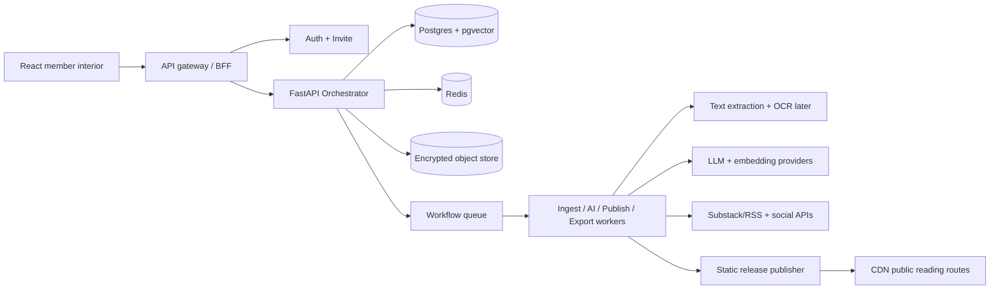

# FastAPI Orchestrator Service

> The self-contained service spec for the Knowledge, Publication, and Digital Footprint
> Graph OS: ingestion, source-backed AI, editorial workflow, publishing, social connector
> imports, export/delete, and the operational loop around all long-running work.

## 1. Purpose

The FastAPI orchestrator is the product engine behind the member interior. It coordinates
work that should not live in the frontend, the legacy Flask shell, or one-off scripts:

- source upload and ingestion;
- text extraction, chunking, embeddings, and source ledger creation;
- scoped AI summaries and question answering;
- book, essay, and collection drafting;
- editorial review and immutable publication releases;
- digital footprint graph snapshots and social connector imports;
- export, deletion, and retention workflows;
- connector syncs once connectors are allowed.

The orchestrator is not a social feed, notification engine, generic chatbot, or analytics
collector. It exists to help members read, write, cite, publish, export, and leave with
their data intact.

## 2. System position

The existing Flask backend can keep serving current prototype routes while the
orchestrator owns new knowledge and publication APIs. The boundary is explicit:

- Flask/BFF: current app shell, donations, metrics prototypes, public twin prototype.
- FastAPI orchestrator: Knowledge Vault, Publication Studio, AI assistant, footprint
  graph, publishing jobs, ingestion jobs, connector import jobs, export/delete jobs.
- Auth/Invite service: source of truth for identity, sessions, and invite status. The
  orchestrator verifies tokens; it does not issue identity credentials in the first cut.



## 3. Core responsibilities

### O1 - Request orchestration

Accept authenticated member actions, validate ownership and permissions, create a durable
`orchestrator_run`, and move the run through named steps. Every workflow has a run ID,
step IDs, idempotency keys, status, retry policy, and audit events.

### O2 - Source ingestion

Receive uploads or connector objects, store encrypted originals, extract text, compute
checksums, chunk content, create source ledger records, and index private chunks.

### O3 - Source-backed AI

Retrieve only the member-selected sources, pass bounded context to model providers, and
return answers with source anchors. If the selected sources do not support an answer, the
assistant must say so.

### O4 - Publication workflow

Manage projects, sections, revisions, citations, editorial state, release validation, and
static publishing. Published releases are immutable snapshots.

### O5 - Digital footprint graph

Track member-owned platform accounts, imported artifacts, graph nodes, graph edges,
identity links, trusted circles, provenance, confidence, visibility, and graph snapshots.
Connector imports normalize external platforms into graph records through durable runs.

### O6 - Data rights

Implement member export, deletion, archival, retention, and key-destruction flows. These
are first-class workflows, not manual admin tasks.

### O7 - Operational visibility without surveillance

Expose health, readiness, metrics, run status, and aggregate failure rates. Logs and traces
carry IDs and state transitions, not raw private content, prompts, source text, or
retrieved context.

## 4. Recommended stack

| Layer | Choice | Notes |
| --- | --- | --- |
| API | FastAPI + Pydantic v2 | Typed contracts, OpenAPI, async IO, streaming-ready. |
| ASGI | Uvicorn workers behind gunicorn or platform equivalent | Stateless API containers. |
| Database | Postgres 16+ | Primary source of truth for metadata, runs, revisions, audit events. |
| ORM/migrations | SQLAlchemy 2 async + Alembic | Clear schema evolution. |
| Vector search | pgvector first | Keep MVP self-contained; extract later if scale requires it. |
| Queue | Redis + Dramatiq | Simple self-contained workers, retries, dead-letter handling. |
| Cache/rate limits | Redis | Hot status reads, short TTL rate-limit keys, transient locks. |
| Object storage | S3-compatible bucket | R2/S3/GCS/MinIO; encrypted blobs and rendered release assets. |
| HTTP clients | httpx | Outbound connectors and model-provider calls. |
| Observability | OpenTelemetry + Prometheus metrics + structured logs | Redacted by default. |
| Test/lint | pytest, respx, ruff, mypy where useful | Contract and workflow tests matter most. |

Temporal can replace Dramatiq when workflows become multi-day, highly branched, or need
human-in-the-loop timers with stronger durability. The API contract should not depend on
the queue implementation.

## 5. Service layout

Target directory shape if the orchestrator lives under `backend/orchestrator/`:

```text
backend/orchestrator/
  app/
    main.py
    settings.py
    api/
      v1/
        health.py
        sources.py
        knowledge.py
        assistant.py
        publications.py
        graph.py
        runs.py
        exports.py
    auth/
      dependencies.py
      permissions.py
    db/
      session.py
      models.py
      migrations/
    domains/
      sources/
      ingestion/
      knowledge/
      assistant/
      publication/
      graph/
      connectors/
      export_delete/
      audit/
    workers/
      broker.py
      ingest_worker.py
      assistant_worker.py
      publish_worker.py
      export_worker.py
    integrations/
      object_store.py
      embeddings.py
      llm.py
      extractors.py
      connectors/
    tests/
```

Rule: routes are thin. Domain services own behavior. Workers call the same domain services
as the API and must be idempotent.

## 6. Domain model

The data model extends the sketch in `04-KNOWLEDGE-AND-PUBLICATION.md` with durable runs
and publication releases.

```text
orchestrator_runs
  id, owner_id, workflow_type, status, idempotency_key, requested_by,
  input_ref, output_ref, error_code, created_at, started_at, completed_at

orchestrator_steps
  id, run_id, step_name, status, attempt_count, locked_until,
  input_ref, output_ref, error_code, started_at, completed_at

source_objects
  id, owner_id, title, source_type, origin_uri, rights_status, visibility,
  object_key, encryption_key_id, checksum, byte_size, status,
  created_at, processed_at, deleted_at

source_versions
  id, source_id, version, object_key, text_object_key, checksum,
  extraction_method, created_at

knowledge_chunks
  id, source_id, source_version_id, owner_id, sequence, text_ciphertext_ref,
  locator, token_count, checksum, created_at

knowledge_embeddings
  id, chunk_id, owner_id, embedding_model, vector, created_at

source_anchors
  id, source_id, chunk_id, locator, quote_hash, label, created_at

publication_projects
  id, owner_id, type, title, slug, status, visibility, created_at, updated_at

publication_sections
  id, project_id, parent_id, section_order, title, body_ref, status,
  created_at, updated_at

publication_revisions
  id, section_id, editor_id, body_ref, message, created_at

publication_citations
  id, project_id, section_id, anchor_id, claim_hash, citation_style, created_at

publication_releases
  id, project_id, version, slug, status, manifest_key, rendered_at,
  published_at, revoked_at

audit_events
  id, owner_id, actor_id, event_type, subject_type, subject_id,
  metadata_json, created_at

data_exports
  id, owner_id, status, object_key, expires_at, created_at, completed_at

deletion_requests
  id, owner_id, scope, status, requested_at, completed_at

footprint_accounts
  id, owner_id, platform, handle, display_name, profile_url, external_id,
  auth_mode, status, sync_cursor, last_synced_at, revoked_at

footprint_nodes
  id, owner_id, kind, label, platform, external_id, source_ref, properties,
  visibility, confidence, first_seen_at, last_seen_at

footprint_edges
  id, owner_id, source_node_id, target_node_id, relation, platform, weight,
  confidence, evidence_ref, first_seen_at, last_seen_at

footprint_imports
  id, owner_id, account_id, run_id, connector, import_mode, status,
  requested_by, source_ref, summary, created_at, completed_at
```

Private body text can be stored as encrypted object references (`body_ref`,
`text_ciphertext_ref`) rather than plaintext columns. Public release manifests contain
only content explicitly published by the member.

## 7. API surface

All endpoints are versioned under `/v1`. Member endpoints require an authenticated owner
context. Public release endpoints are read-only and served from static assets whenever
possible.

### Health and operations

```text
GET  /healthz
GET  /readyz
GET  /metrics
GET  /v1/runs/{run_id}
POST /v1/runs/{run_id}/cancel
```

Run status states: `queued`, `running`, `waiting_for_member`, `succeeded`, `failed`,
`cancelled`.

### Sources

```text
POST   /v1/sources/uploads
POST   /v1/sources/{source_id}/complete-upload
POST   /v1/sources/{source_id}/process
GET    /v1/sources
GET    /v1/sources/{source_id}
GET    /v1/sources/{source_id}/chunks
PATCH  /v1/sources/{source_id}
DELETE /v1/sources/{source_id}
```

Upload flow:

1. API creates `source_objects` row and returns a pre-signed object-store upload target.
2. Client uploads directly to object storage.
3. Client calls `complete-upload`.
4. Orchestrator creates an ingestion run.
5. Worker extracts, chunks, embeds, and marks the source `ready`.

### Assistant

```text
POST /v1/assistant/query
POST /v1/assistant/summarize-source
POST /v1/assistant/summarize-collection
POST /v1/assistant/draft-section
```

Minimum request contract:

```json
{
  "scope": {
    "source_ids": ["src_..."],
    "project_id": "pub_..."
  },
  "intent": "answer_question",
  "question": "What are the strongest claims in chapter 2?",
  "citation_required": true
}
```

Minimum response contract:

```json
{
  "answer": "The selected sources support three claims...",
  "citations": [
    {
      "source_id": "src_...",
      "chunk_id": "chk_...",
      "locator": "page 12",
      "anchor_id": "anc_..."
    }
  ],
  "unsupported_claims": []
}
```

### Publication Studio

```text
POST   /v1/publications/projects
GET    /v1/publications/projects
GET    /v1/publications/projects/{project_id}
PATCH  /v1/publications/projects/{project_id}
POST   /v1/publications/projects/{project_id}/sections
PATCH  /v1/publications/sections/{section_id}
POST   /v1/publications/sections/{section_id}/revisions
POST   /v1/publications/projects/{project_id}/validate
POST   /v1/publications/projects/{project_id}/releases
GET    /v1/publications/projects/{project_id}/releases
POST   /v1/publications/releases/{release_id}/revoke
```

Publication states: `draft`, `in_review`, `ready_to_publish`, `published`, `archived`.
Release states: `rendering`, `published`, `failed`, `revoked`.

### Digital footprint graph

```text
POST /v1/graph/accounts
GET  /v1/graph/accounts
POST /v1/graph/nodes
POST /v1/graph/edges
POST /v1/graph/imports
GET  /v1/graph/imports
GET  /v1/graph/imports/{import_id}
POST /v1/graph/imports/{import_id}/process
GET  /v1/graph/snapshot
```

Minimum Substack RSS import request:

```json
{
  "connector": "substack",
  "import_mode": "rss",
  "account_id": "acct_...",
  "source_ref": {
    "feed_url": "https://example.substack.com/feed"
  }
}
```

Graph snapshot response:

```json
{
  "owner_id": "member_...",
  "accounts": [],
  "nodes": [],
  "edges": []
}
```

The snapshot is the UI contract for graph-based navigation. Workers populate it by
normalizing imports into nodes and edges with source/evidence references.

Account creation is idempotent by `owner_id`, `platform`, and `handle` so repeated
source imports do not create duplicate platform accounts. Import creation is idempotent
through the run-scoped idempotency key. `GET /v1/graph/imports` is the UI contract for
recent connector status, summaries, and run linkage.

The first processor supports RSS-compatible feeds, including Substack public publication
feeds. It produces platform account, publication, post, and topic nodes plus authored,
published-to, and mentions edges.

RSS fetches are treated as a security boundary. The processor accepts only `http` and
`https` feed URLs, rejects credentials and local/private network targets, resolves DNS
before fetching, follows a bounded redirect chain, restricts feed content types, and caps
feed bodies at 2 MB.

### Export and delete

```text
POST /v1/exports
GET  /v1/exports/{export_id}
POST /v1/deletion-requests
GET  /v1/deletion-requests/{request_id}
```

Exports include metadata, source files, publication drafts, release manifests, citations,
audit events, and a human-readable index. Delete workflows remove active rows, object
blobs, derived embeddings, cached run output, and eventually destroy or rotate relevant
data encryption keys.

## 8. Workflow specs

### W1 - Ingest source

```text
created -> uploaded -> extracting -> chunking -> embedding -> indexed -> ready
```

Failure states: `upload_expired`, `extract_failed`, `unsupported_type`,
`embedding_failed`, `permission_failed`.

Invariants:

- A source cannot become `ready` without a checksum, source version, and ledger records.
- Reprocessing creates a new source version; it does not mutate old chunks in place.
- Deleting a source tombstones metadata and removes object blobs, chunks, embeddings, and
  anchors unless a public release legally depends on an already-published citation.

### W2 - Ask over selected sources

```text
validate scope -> retrieve chunks -> build redacted prompt -> call model ->
verify citation coverage -> return answer -> optionally save member-approved note
```

Invariants:

- Scope is explicit. No default "all member data" retrieval.
- Guest mode can use public context only and defaults to zero retention.
- Raw prompts, retrieved chunks, and answers are not written to logs or analytics.

### W3 - Draft a publication section

```text
select project + sources -> create outline -> generate draft with citations ->
save as revision -> wait for human edit/approval
```

Invariants:

- AI drafts are never published automatically.
- Citations are attached to claims or section-level source notes.
- Human edits create revisions; the release validator checks citation coverage again.

### W4 - Publish release

```text
validate project -> freeze revision graph -> render pages -> generate manifest ->
write release assets -> invalidate CDN -> mark release published
```

Invariants:

- A release is immutable. Corrections create a new release version or revoke a release.
- Public pages read from the release manifest, not live draft tables.
- Public assets contain no private annotations or unpublished source text.

### W5 - Export/delete

```text
authorize -> enumerate data -> freeze snapshot -> build archive or deletion plan ->
execute -> verify object/row/key cleanup -> audit completion
```

Invariants:

- Export and delete are member-initiated and reversible until execution starts.
- Deletion status remains inspectable without preserving deleted content.
- Support/admin paths cannot bypass member ownership checks.

### W6 - Import digital footprint connector

```text
authorize connector or accept member archive -> create footprint_import run ->
fetch/read source -> normalize records -> upsert nodes -> upsert edges ->
write import summary -> update graph snapshot
```

Invariants:

- Imports are explicit, idempotent, inspectable, and revocable.
- Substack starts with RSS and member-provided export files; unofficial write/private APIs
  are not a production dependency.
- Connector fetches must reject local/private network targets and oversized responses.
- Cross-owner graph edges are rejected.
- `same_as` identity links require member confirmation unless they come from a verified
  platform identity proof.
- Every inferred edge has confidence and evidence; low-confidence edges remain private
  until verified.

## 9. Security and privacy requirements

- All member-scoped queries include `owner_id` from verified auth context.
- Every state-changing request accepts an idempotency key.
- Private content is encrypted before persistence; object keys and ciphertext metadata are
  not treated as permission checks.
- Logs, traces, metrics, and errors must not include source text, prompts, retrieved
  context, draft bodies, private notes, emails, or raw external identity values.
- Model-provider calls use no-training/no-retention terms where available and must be
  routed through one integration layer for policy enforcement.
- Connector tokens are encrypted, scoped, revocable, and never exposed to workers that do
  not need them.
- Graph nodes and edges are owner-scoped; a social edge does not grant access to private
  source text, private notes, or unpublished publication state.
- Public release validation is the only path from private draft to public asset.
- Rate limits are per account and per short-lived blind identity key; avoid building
  behavioral profiles.

## 10. Publication system contract

The publication system is built around durable work, not audience capture.

- Drafts are private by default.
- Review is explicit and reversible.
- Publishing creates an immutable release.
- Public reading pages have no engagement counters, autoplay-next, or feed rail.
- Citations point to source anchors; private source text is not exposed unless the member
  explicitly publishes it.
- Public pages are static-first and CDN-cached.
- Exports preserve enough structure to rebuild the book outside the platform.

MVP formats:

- Web release manifest and static HTML/MDX rendering.
- Markdown export.
- PDF/EPUB later after the release manifest is stable.

## 11. Local and production deployment

### Local development

Self-contained local stack:

```text
orchestrator-api   FastAPI app on :8000
orchestrator-worker Dramatiq worker process
postgres           metadata + pgvector
redis              queue + cache
minio              S3-compatible object store
```

The existing frontend can point to the orchestrator through `VITE_ORCHESTRATOR_URL`.
The existing Flask backend can continue running on port 5000 during migration.

### Production

- API containers: stateless, autoscaled, readiness-gated.
- Worker pools: scaled independently by queue depth and workflow type.
- Postgres: managed primary, PITR backups, read replicas when needed, pgvector enabled.
- Redis: managed, persistence appropriate for queue durability, eviction policy reviewed.
- Object storage: private bucket for encrypted originals and drafts; public bucket or CDN
  prefix for release assets.
- CDN: serves public releases and static profile assets.
- Secrets: environment/secret manager only; no secrets in repo or release manifests.

## 12. SLOs and budgets

Initial targets:

- API p95 latency under 250 ms for metadata reads.
- Run status reads under 100 ms from cache or indexed DB query.
- Source ingestion starts within 10 seconds of upload completion.
- Publication release renders under 60 seconds for a normal book project.
- Public reading pages keep the architecture budget from `02-ARCHITECTURE.md`: LCP under
  2.0 seconds on 4G and CLS under 0.05.

## 13. MVP build order

1. Scaffold FastAPI app, config, health checks, Postgres, Redis, object store, migrations.
2. Auth adapter: verify existing session/JWT and produce `owner_id`.
3. Publication Studio core: projects, sections, revisions, validation, web release.
4. Static release publisher: manifest, rendered assets, CDN/object-store write.
5. Manual upload source flow: pre-signed upload, extraction, chunks, status.
6. pgvector embeddings and source-backed summaries over selected sources.
7. Export/delete workflows.
8. Connector framework, starting with read-only imports and explicit revocation.

Do not start with connectors or a general chatbot. The first usable product is a calm book
workspace that can publish Henok's work and then attach sources behind it.

## 14. Definition of done

The orchestrator is ready for the first production member when:

- OpenAPI contracts exist for all MVP endpoints.
- Alembic migrations create the domain tables listed above.
- API and workers run from the same domain services.
- Ingestion, publish, export, and delete workflows are idempotent and tested.
- AI responses include citations or explicit unsupported-claim markers.
- Public release pages are served from immutable manifests.
- Logs and traces have redaction tests.
- A member can export and delete their data without staff intervention.
- CI runs lint, unit tests, workflow tests, and migration checks.
