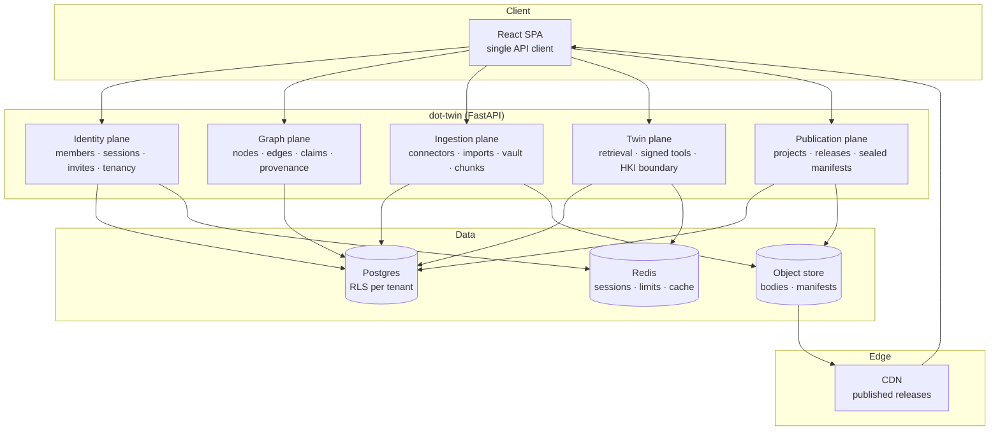
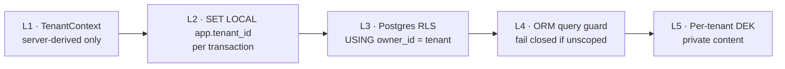
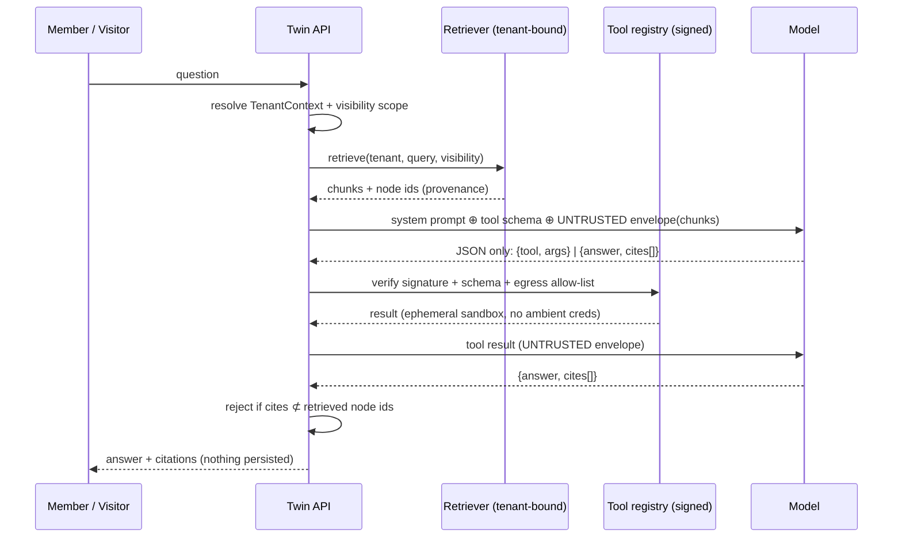
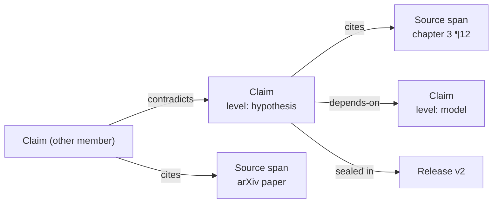

# The Digital Twin Platform

> The consolidation design. One service — the **Twin** — is the runtime for every
> member's digital footprint: it holds the graph, ingests the sources, answers as the
> member, and seals what the member chooses to publish.
>
> Supersedes the split between `backend/src` (Flask prototype) and
> `backend/orchestrator` (FastAPI). See ADR-0009, ADR-0010, ADR-0011.

---

## 1. What we are building

A **digital twin** is not a chatbot with a persona. It is a *tenant-scoped runtime over a
member-owned graph*:

- Everything the twin knows is an explicit node with provenance.
- Everything the twin says cites the nodes it used.
- Everything the twin can do is a signed tool in a closed registry.
- Nothing the twin sees crosses a tenant boundary, ever.

The binding invariant from `CLAUDE.md` applies to the twin without exception:

> Every connector, AI action, UI view, and publication workflow must resolve to explicit
> nodes, edges, provenance, consent, and portability. A feature that cannot answer
> "which nodes, which edges, whose consent, what provenance, how does it export" is not
> ready to build.

The twin makes this testable: if the agent cannot name the node ids behind a sentence,
the sentence does not ship.

## 2. Current state (why we are consolidating)

Two backends serve the same nouns.

| Concern         | `backend/src` (Flask)                     | `backend/orchestrator` (FastAPI)               |
| --------------- | ----------------------------------------- | ---------------------------------------------- |
| Auth            | OTP + `itsdangerous` cookie, `auth.db`    | OTP + JWT session cookie, `members` table       |
| Profile graph   | `data/profiles/{owner}.json` flat file    | `footprint_nodes` / `footprint_edges` (unused)  |
| Publications    | `data/publications/{owner}.json`          | projects → sections → releases → sealed manifest |
| Twin / AI       | `POST /api/twin/ask`, Gemini, no grounding | none                                            |
| Circle, invites | signed tokens in memory                   | `invite_codes` table                            |
| Storage         | SQLite + JSON files                       | Postgres + object store                         |

The frontend calls **both**. The orchestrator's footprint graph — the most valuable asset
in the codebase — has zero frontend callers. The Flask JSON-file graph is what actually
renders on the homepage.

**Decision:** Flask is retired. The orchestrator absorbs the three capabilities that only
existed there (profile graph, twin ask, circle) and becomes the single API. Everything
else in Flask (blog, forum, courses, users, donations, metrics) is prototype scaffolding
with no place in the product and is deleted rather than ported.

## 3. Target architecture — one service, five planes

Planes are modules inside one deployable, not microservices. ADR-0002 (modular monolith
then services) still governs: extract only when a plane has its own scaling curve.

### 3.1 Plane responsibilities

| Plane           | Owns                                                                  | Never does                                    |
| --------------- | --------------------------------------------------------------------- | --------------------------------------------- |
| **Identity**    | Members, OTP, sessions, invites, `TenantContext` resolution            | Business logic; it only answers "who and whose" |
| **Graph**       | Nodes, edges, claims, accounts, snapshot, provenance, export, delete   | Network I/O                                    |
| **Ingestion**   | Connectors, imports, uploads, extraction, chunking, anchors            | Interpretation — it records, it does not judge |
| **Twin**        | Retrieval, tool dispatch, answer composition, citation enforcement     | Persist prompts; touch another tenant          |
| **Publication** | Projects, sections, revisions, releases, sealed manifests, delivery    | Mutate a sealed release                        |

## 4. Tenant isolation

Application-level `WHERE owner_id = ...` is the only thing standing between tenants today.
That is one forgotten clause away from a cross-tenant leak, and it does not survive a
codebase this size at millions of members. We move to **defense in depth, fail closed**.

**L1 — Context.** `TenantContext` is derived from a verified session JWT or a trusted
gateway assertion. `X-Owner-Id` header trust is permitted **only** when
`AUTH_MODE=local_header`, which is rejected at startup in staging and production.

**L2 — Transaction binding.** Every request opens a transaction that begins with
`SET LOCAL app.tenant_id = '<owner_id>'`. `SET LOCAL` dies with the transaction, so a
pooled connection can never carry a stale tenant into the next request.

**L3 — Row-level security.** Every tenant table carries `ENABLE ROW LEVEL SECURITY` +
`FORCE ROW LEVEL SECURITY` with a policy of
`USING (owner_id = current_setting('app.tenant_id', true))`. The application role is not
`BYPASSRLS`. A missing `WHERE` clause now returns zero rows instead of another member's
data. Migrations and workers use a separate role that sets the tenant explicitly per job.

**L4 — Query guard.** A SQLAlchemy `before_execute` hook inspects statements against
tenant tables and raises `TenantScopeError` when neither RLS is active (SQLite in tests)
nor an `owner_id` predicate is present. This keeps the test suite honest and catches
mistakes in development where RLS is not enforced.

**L5 — Content encryption.** Per ADR-0007, private bodies are encrypted with a
tenant-scoped DEK before they reach Postgres or the object store. RLS protects rows; the
DEK protects bytes. Identity lookups use blind indexes (`email_hash`), already in place.

**Public delivery is the deliberate exception.** Sealed release manifests and bodies are
served from an unauthenticated route because the member chose to publish them. Those rows
are read through an explicit `public_delivery` path that queries by
`(owner_id, slug, status='published')` and never accepts a tenant context from the caller.

## 5. The twin agent and HKI conformance

The twin is an LLM loop with hard walls. It conforms to **Hermetic Knowledge Isolation**:
a signed-domain runtime, a rigid MCP data boundary, and ephemeral isolated execution.

### HKI controls

| ID        | Control                   | Implementation                                                                                                       |
| --------- | ------------------------- | -------------------------------------------------------------------------------------------------------------------- |
| **HKI-1** | Signed-domain runtime     | Every tool ships a manifest (name, JSON Schema, egress hosts). The registry stores an HMAC over the canonical manifest and refuses to dispatch an unsigned or mutated tool. |
| **HKI-2** | MCP boundary              | The model may emit only JSON matching a closed union. No shell, no `eval`, no free-form URL, no SQL. Malformed output is a refusal, not a retry-with-fix. |
| **HKI-3** | Ephemeral execution       | File and document work runs in a short-lived sandbox with no ambient credentials and no filesystem outside the run directory. |
| **HKI-4** | Context integrity         | Tenant content is never concatenated into the system prompt. It is passed inside an explicit untrusted-data envelope, and instructions found inside that envelope are ignored by contract and by evaluation. |
| **HKI-5** | Egress control            | The tool manifest declares its hosts. Anything outside the union of declared hosts is blocked at the HTTP client. Connectors are the only network path out. |
| **HKI-6** | Zero retention            | Prompts, retrieved context, and answers are not written to the database, logs, traces, or Sentry. The existing `RedactingJsonFormatter` is the floor, not the ceiling. |
| **HKI-7** | Tenant-bound retrieval    | The retriever takes a `TenantContext`, not an `owner_id` string. It runs inside the RLS transaction. Cross-tenant retrieval is not a policy, it is impossible. |

**Visibility scopes.** A visitor asking the public twin gets `visibility='public'` — only
published nodes. A signed-in member gets `visibility='private'` over their own graph and
`visibility='circle'` over nodes explicitly shared with them. The scope is resolved
server-side and is an argument to the retriever, not a filter applied afterward.

**Citation enforcement is the product.** An answer whose `cites[]` contains a node id that
was not in the retrieved set is dropped and the member sees "I do not have a grounded
answer for that." This is what makes a twin trustworthy rather than merely fluent.

## 6. The claim — the graph primitive

The book manifest already declares `claim_levels: [Observation, Model, Hypothesis,
Speculation]`. That becomes a first-class node kind, and it is what makes DOT a movement
platform rather than a personal site.

- `kind='claim'` on `footprint_nodes`, with `epistemic_level` in properties.
- Relations reuse the existing edge vocabulary: `supports`, `contradicts`, `refines`,
  `depends-on`, `supersedes`, `cites`.
- A `contradicts` edge **must** carry `evidence_ref`. Disagreement requires evidence; that
  is the structural anti-feed.
- Cross-tenant edges are consented, one row per side, and never bypass RLS: member A stores
  the outbound edge in A's tenant, member B stores the accepted inbound edge in B's.
- No counts are exposed anywhere. A claim shows what it rests on and what contests it.

## 7. Scaling to millions

| Concern         | Approach                                                                                                  |
| --------------- | --------------------------------------------------------------------------------------------------------- |
| API tier        | Stateless; sessions in Redis; horizontal scale behind the gateway.                                          |
| Hot tables      | `footprint_nodes` / `footprint_edges` partitioned by `owner_shard smallint` derived from `hash(owner_id)`. Every index leads with `owner_id`. |
| Read amplification | Published content never touches Postgres. Sealed manifests and bodies are immutable objects behind a CDN with long TTLs, invalidated only on new release. |
| Write path      | Imports are queued, idempotent (`Idempotency-Key`), resumable via `sync_cursor`, and isolated per queue class so a slow connector cannot starve publishing. |
| Twin cost       | Retrieval cache keyed `(tenant, visibility, query_hash)` in Redis with short TTL. Cache entries are tenant-partitioned and evicted on graph mutation. |
| Large blobs     | Bodies live in the object store; the database stores refs only. This is already true and must stay true.     |
| Noisy neighbours | Rate limits keyed by tenant, not IP, for authenticated routes; per-tenant concurrency ceiling on twin runs. |
| Sharding escape | `owner_shard` makes a future move to per-shard databases a routing change, not a data migration.            |

## 8. Consolidation plan

| Phase | Work                                                                                                     | Ships                         |
| ----- | -------------------------------------------------------------------------------------------------------- | ----------------------------- |
| **C1** | Tenant isolation: `TenantContext`, transaction binding, RLS migration, query guard.                       | Isolation is structural.       |
| **C2** | Twin plane: signed tool registry, MCP boundary, tenant-bound retriever, citation enforcement, `/v1/twin/ask`. | The twin exists.               |
| **C3** | Port the profile graph to `/v1/graph/profile`; point the nucleus at the real footprint graph.              | The graph OS becomes visible.  |
| **C4** | Port circle/invites onto `invite_codes`; delete the Flask app and its JSON stores.                         | One backend.                   |
| **C5** | Claims: node kind, edge constraints, reader capture, `/doctrine` reads the graph.                          | The movement primitive.        |
| **C6** | `/me`: export (JSON-LD + markdown), delete with receipt, connector inventory.                              | Portability is a product.      |

Nothing in Flask is ported wholesale. Blog, forum, courses, users, donations, and metrics
routes are deleted — they are prototype residue that never belonged to this product.

## 9. What "done" means

- Exactly one backend, one API base URL, one auth flow.
- A cross-tenant read is impossible without disabling RLS *and* removing the query guard.
- Every twin answer carries node ids the member can open.
- No prompt, retrieved chunk, or answer appears in any log, trace, or table.
- The homepage nucleus renders `/v1/graph/snapshot`.
- Every member-visible object has a URL, an export, and a delete.
