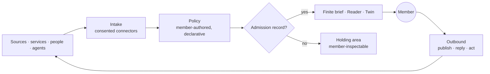

# The Attention Membrane

> **Running design doc.** Unlike the numbered blueprints above it, this document is
> expected to change often. It holds the current thinking on Stay as the layer members
> route their digital exposure through — inbound and outbound — plus open questions and a
> dated log of what changed and why.
>
> Locked decisions graduate out of here into ADRs. If this doc and an ADR disagree, the
> ADR wins.

- **Status:** Exploring (no membrane code written yet)
- **Owns:** the filter thesis, staging, open questions
- **Governed by:** ADR-0001, ADR-0004, ADR-0010, ADR-0013, ADR-0014, ADR-0015

---

## 1. The thesis

Members should be able to route what they are exposed to — newsletters, feeds,
subscriptions, services, eventually messages and agent output — **through Stay**, and have
Stay be the membrane rather than another destination.

The bet is not that we can rank better. It is that we can be the only layer that can
**explain itself**, because ADR-0001 made members the buyer and ADR-0015 keeps it that way.
Every ad-funded filter must keep its delivery logic opaque; unexplained placement is its
revenue. Ours can be fully legible, and legibility is the product.

**Positioning for the AI era:** the member's real problem is no longer volume. It is that
they cannot tell what is real, what is generated, and what an agent did on someone else's
behalf. Stay is where provenance is enforced. That is the wedge, and it is the same
capability in both directions.

## 2. The model

Stay already enforces provenance outbound. The membrane is the same discipline pointed
inbound.

| Direction    | Question                       | Enforcement                                | Status  |
| ------------ | ------------------------------ | ------------------------------------------ | ------- |
| **Outbound** | Why did the twin say this?     | `cites[]` ⊆ retrieved node ids (ADR-0010)   | Built   |
| **Inbound**  | Why did this reach me?         | Admission record: rule + source + voucher (ADR-0013) | Not built |

Three layers, each with a hard rule:

1. **Intake** — connectors with explicit scopes and revocation (doc 07 posture). Nothing
   enters without consent and a source node.
2. **Policy** — a member-authored document, executed literally. No learned ranking
   (ADR-0014).
3. **Presentation** — finite briefs with an end, the Reader (P2), and the twin. No feed, no
   push, no counters (ADR-0004).

## 3. Invariants

These carry the same weight as the graph-OS invariant in doc 07 §1.

- Nothing reaches a member without a member-visible reason. Fail closed.
- The filter's logic is a document the member can read, edit, diff, dry-run, and export.
- No model ranks by predicted engagement, and no behavioral training signal is collected.
- No third party can pay for passage, position, or presentation.
- Every delivered item resolves to nodes, edges, provenance, consent, and portability.
- Briefs are finite and pulled. There is always an end, and leaving is a success state.

## 4. Staging

Each stage must be independently useful; none may be started before the prior one is
boring and reliable.

| Stage | What                                                                 | Why this order                                                            | Platform risk |
| ----- | -------------------------------------------------------------------- | ------------------------------------------------------------------------- | ------------- |
| **1** | Inbound from what the member already owns: RSS, newsletters, Substack, podcast/video subscriptions → one finite brief | Tier 1 in doc 07; no API war; runs on existing graph tables | None          |
| **2** | Policy engine: declarative rules, "why am I seeing this", rule-editing feedback, dry-run | Makes stage 1 trustworthy and testable                     | None          |
| **3** | Circles as the filter: attributed passing-along by trusted people, no counts, no virality | Invite-only stops being a constraint and becomes the moat  | None          |
| **4** | Outbound: publish once/distribute out, then agents acting on services via signed tools (ADR-0010) | Membrane becomes load-bearing; needs 1–3 stable            | Medium        |
| **5** | Default client surface: email, messages, commerce                    | Highest value, highest scope risk; only after 1–4          | High          |

**Current focus: nothing yet.** Stage 1 is not started. The book, graph, and twin work
continue independently.

## 5. Consequence for the current UI

If Stay becomes the filter, **the graph is not the daily surface.** The graph is for
orientation and audit — *what am I exposed to, and why* — while the brief and the Reader
carry daily use. This resolves the standing tension where the profile graph is asked to be
both a navigation menu and a knowledge instrument, and it is why graph layout polish should
not block membrane work.

## 6. Open questions

| # | Question                                                                                     | Blocking |
| - | -------------------------------------------------------------------------------------------- | -------- |
| Q1 | What is the rule language? Structured UI-authored conditions, or a small readable DSL?       | Stage 2  |
| Q2 | Can policy evaluate without the server reading bodies in the clear (ADR-0007 blindness)?     | Stage 2  |
| Q3 | Distribution: a Stay forwarding address, a share-sheet target, or a browser extension?        | Stage 1  |
| Q4 | Excerpt-and-link is the safe copyright posture — where exactly is the line for summaries?     | Stage 1  |
| Q5 | Unit economics: what per-member monthly cost does deterministic evaluation + on-demand inference actually imply? | Stage 1 |
| Q6 | Cold start: what ships as default rule templates without them becoming an editorial feed?     | Stage 2  |
| Q7 | How does the holding area stay pull-only and finite instead of becoming an inbox with a badge? | Stage 2  |
| Q8 | Does `Discernment` in the profile graph become a real surface backed by admission records?    | Stage 2  |

## 7. Risks, ranked

1. **Scope collapse into an everything-app.** Stage 5 is seductive and will starve 1–3. One
   intake type, won completely, first.
2. **Capture.** Closed by ADR-0015 while it is still free to close.
3. **We become the surveillance point.** Being the membrane means seeing everything. L9,
   ADR-0007 per-tenant DEKs, and Q2 are necessary; a real "Stay cannot see this" mode is
   probably also required.
4. **Inference economics.** Member-funded pricing vs. per-item model cost. Mitigated by
   ADR-0014's determinism, but must be measured (Q5), not assumed.
5. **Distribution.** Normies do not adopt new clients. Attach to an existing habit (Q3).
6. **Legal.** Proxying and summarizing third-party content invites ToS and DMCA conflict.
   Excerpt-plus-attribution posture; no full-text reproduction (Q4).
7. **The filter drifting into an algorithm.** Closed by ADR-0014; needs a test in CI once
   any ranking code exists.

## 8. Running log

| Date       | Change                                                                                                     |
| ---------- | ---------------------------------------------------------------------------------------------------------- |
| 2026-08-05 | Doc created. Membrane thesis articulated: inbound provenance as the mirror of ADR-0010's outbound citations. |
| 2026-08-05 | Drafted ADR-0013 (inbound provenance), ADR-0014 (declarative policy, no engagement ranking), ADR-0015 (no paid passage) as **Proposed**. |
| 2026-08-05 | Recorded the UI consequence: graph is for orientation and audit, not daily traffic (§5).                     |
| 2026-08-05 | Profile graph hardened end to end: closed unions for `kind`/`surface`, id/link validation, sibling-id uniqueness, and tests proving the twin cites profile nodes and drops retired ones. The audit half of §2 now has a foundation. |
