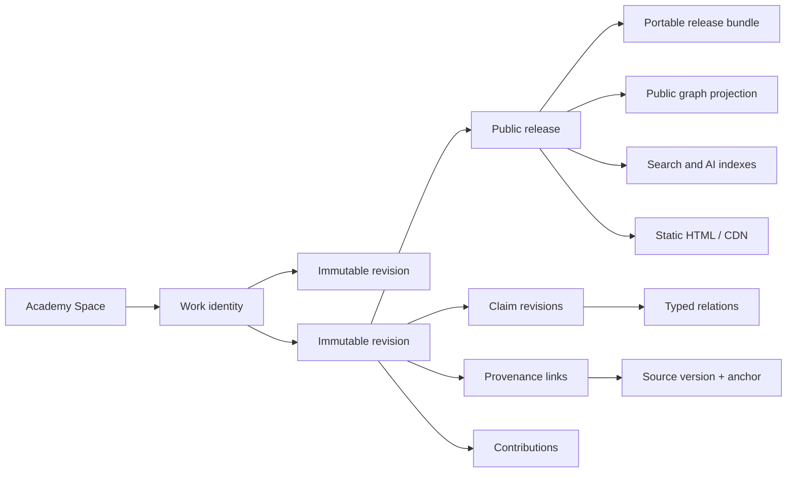
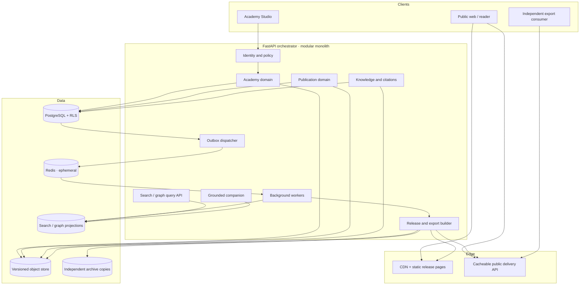

# 13 — DOT Academy Platform

> **Consolidated into `14-INTELLECTUAL-PLATFORM.md` (ADR-0032, 2026-09-02).** Doc 14
> generalizes this design to a space-generic kernel and is authoritative where they
> differ. This file remains the detailed reference annex for the kernel schema (§5),
> kind contracts (§6), lifecycles (§7), and preservation (§16).

> End-to-end architecture for a durable intellectual institution around Digital
> Organism Theory. This document turns ADR-0030 into a platform contract.
>
> **Status:** Proposed design. The Academy landing and its eight-part public
> information architecture exist; the backend Academy kernel described here does
> not yet exist.

---

## 1. Executive decision

The website becomes the living intellectual home of DOT. The book remains a
separate publishing object.

The platform is not an article site, discussion forum, social feed, or mutable
online book. It is a **versioned public argument graph** with three human-facing
programs:

1. **Theory** — definitions, diagrams, hypotheses.
2. **Critical inquiry** — objections, responses, experiments.
3. **Writing** — excerpts, essays.

Books and later formal publications live across a visible publication boundary.
Academy work can cite, interpret, extend, test, or challenge a book. It never
silently becomes part of that book.

The architecture is a modular monolith with a dedicated Academy domain,
PostgreSQL as the source of truth, an object store for immutable content and
artifacts, Redis-backed background work, and static/CDN public delivery. The
knowledge graph, search index, embeddings, AI retrieval index, and rendered site
are projections—not authorities.

This is deliberately less fashionable than a microservice or graph-database
design. It has fewer failure boundaries, stronger transactions, complete
exports, and a credible path to survive changes in interfaces, vendors,
contributors, and stewardship.

---

## 2. The institution we are building

### 2.1 Purpose

The Academy exists to make a developing theory inspectable.

A reader should be able to answer:

- What exactly is being claimed?
- Is this observation, model, hypothesis, or speculation?
- Which definition and assumptions does it depend on?
- Where did it come from?
- What is the strongest objection?
- Has anyone responded, and what remains unanswered?
- What would count against it?
- Has a protocol been frozen before results were known?
- What changed between versions, and why?
- Which statements belong to Book One, and which were developed later?

The platform succeeds when it helps a reader form a better judgment and then
leave. Time spent, return frequency, and agreement are not success measures.

### 2.2 “Academy” is a method, not a credential

At launch, DOT Academy is a founder-stewarded public inquiry. The name does not
claim accreditation, consensus, peer-reviewed journal status, or authority over
belief. If any of those institutional facts change, the site must state the
change precisely and preserve the earlier governance record.

### 2.3 Initial institution, reusable platform

DOT Academy is the first and only public institution in the initial product.
The data model carries an `academy_space_id` so another independently governed
academy can exist later without sharing editorial authority or records. The UI
does not expose multi-academy administration until a real second institution
exists.

This avoids two errors:

- hard-coding the founder as the permanent root of authority; and
- building a generic “academy builder” before DOT Academy has proven the model.

---

## 3. Binding invariants

These are release gates, not intentions.

### A1. One stable work identity, many immutable revisions

A work keeps one opaque identity across title, slug, program, and status changes.
Every saved editorial checkpoint is an immutable revision. Public corrections
create new revisions.

### A2. A release never changes

A public release resolves to one exact revision, exact assets, a manifest, and
content hashes. “Latest” is an alias; a versioned URL is permanent.

### A3. Claims are addressable below the document level

Claim levels cannot remain a label on a whole essay or chapter. Every material
claim has a stable claim identity and a versioned statement. A work may contain
claims at several epistemic levels.

### A4. Provenance is required at release

A released claim either points to precise sources, identifies itself as an
author-originated proposal, or states why no external source applies. “Source
unknown” is a visible state, never an omitted field.

### A5. Canon and Academy work are different namespaces

Book release identifiers, Academy release identifiers, and external source
identifiers never collapse into one generic “content” type. Cross-boundary links
are explicit relations.

### A6. Criticism cannot be erased by response

An objection remains a first-class released work after a response is published.
A response links to it. “Answered” and “resolved” are different states, and a
response author cannot mark their own objection resolved without the governing
policy's required review.

### A7. Negative and inconclusive results remain discoverable

Experiment outcomes are never sorted, hidden, or deleted because they weaken a
claim. Retractions and withdrawals preserve a public tombstone and reason.

### A8. Public graph and search are explainable projections

No popularity, recency, agreement, dwell time, or contributor status enters
ranking. A result can state why it appeared: text match, typed relation, declared
topic, source, or editorial path.

### A9. Private by default; release is explicit

Drafts, reviews, imported sources, and experiment workspaces are private until a
release action widens them. Public delivery reads only from release projections.

### A10. AI never becomes an authority layer

AI can extract, compare, summarize, suggest links, and answer from released
sources. It cannot assign claim levels, accept a review, close an objection,
interpret an experiment as support, or publish. Every public answer identifies
whether it is quoting Book canon, Academy work, or an external source.

### A11. The institution can leave its software

Every release exports as human-readable files plus documented machine-readable
metadata and checksums. Restoring the record cannot require this application,
its database, its embedding provider, or its AI vendor.

### A12. Attention remains protected

No feeds, infinite scroll, autoplay-next, streaks, badges, popularity counters,
push interruptions, behavioural profiles, or engagement ranking. Academy pages
have a beginning, a focus, typed exits, and an end.

### A13. A conventional account is represented, not caricatured

Any “conventional account” shown beside DOT states its field and scope, names
the source or sources being represented, records when they were reviewed, and
uses the strongest defensible formulation. “Widely accepted” is context, not
evidence of truth. Visual distinction may clarify provenance; it may not frame
another account as a warning that the reader should dismiss.

---

## 4. Bounded contexts

The Academy joins the current modular monolith as a bounded context. It does not
absorb every existing domain.

| Context | Owns | Does not own |
| --- | --- | --- |
| **Academy** | Works, revisions, claims, typed relations, review state, experiment records, Academy releases | Book manuscripts, imported private files, member social footprints |
| **Publication** | Books and other fixed multi-section publications, editions, release manifests, commercial copies | Living definitions, responses, objection status |
| **Knowledge** | Source objects, versions, extraction, chunks, anchors, embeddings | Editorial truth or epistemic classification |
| **Identity & access** | Members, institutions, roles, invitations, sessions, scopes | Authorship claims or contributor credit |
| **Graph** | Member-owned footprint and public navigation projections | Academy truth, revision history, review workflow |
| **Delivery** | Static projections, public manifests, caching, sitemap, exports | Draft state |
| **Twin** | Source-bounded retrieval and answers | Publishing decisions, review decisions, claim classification |

### 4.1 Why the footprint graph is not the Academy database

`footprint_nodes.properties` is appropriate for flexible imported metadata. It
is not sufficient for rules such as “an experiment run must reference a frozen
protocol” or “a public response must target an immutable objection release.”
Those rules require foreign keys, constraints, transactions, and typed state.

Academy releases may create derived `publication`, `source`, `topic`, and
`claim` nodes in a public graph projection. Deleting and rebuilding that
projection must not affect the Academy record.

### 4.2 Why the Publication domain remains separate

A book is ordered, bounded, and editioned as a whole. An Academy definition or
objection has an independent lifecycle. Reusing the publication editor and
renderer is sensible; representing every Academy work as a hidden one-section
book is not. Shared capabilities belong in libraries. Domain identity remains
separate.

---

## 5. Core domain model

### 5.1 Conceptual model



### 5.2 Proposed tables

Names are illustrative but intentionally concrete.

#### `academy_spaces`

One governed institution.

```text
id, custodian_owner_id, slug, title, description, status,
governance_policy_revision_id,
created_at, updated_at
```

The first row is DOT Academy. `custodian_owner_id` bridges to the repository's
current owner tenancy for initial operations; it does not confer editorial
authority and can later name an organizational custodian. Do not use the
founder's member ID as the institution ID or infer Academy powers from
custodianship.

#### `academy_memberships` and `academy_role_grants`

Institutional access is explicit and time-bounded where appropriate.

```text
academy_memberships:
  id, academy_space_id, member_id, membership_state,
  invited_by, joined_at, ended_at

academy_role_grants:
  id, membership_id, role, program_scope?, work_scope?,
  policy_revision_id, granted_by, valid_from, valid_until?, revoked_at?
```

A member can hold several scoped roles. A grant never follows from public
authorship, contribution credit, social proximity, or infrastructure access.
All authority checks resolve the active grant and the policy revision that
governs the requested transition.

#### `academy_works`

Stable identity of one intellectual object.

```text
id, academy_space_id, kind, canonical_slug,
program, visibility, lifecycle_state,
created_by, created_at, updated_at
```

`kind` is a closed initial union:

```text
definition | diagram | hypothesis | objection |
response | experiment | excerpt | essay
```

New kinds require a schema migration and editorial contract. A free-form string
would let the taxonomy dissolve without review.

#### `academy_revisions`

Immutable content snapshot.

```text
id, work_id, revision_number, schema_version,
title, summary, body_ref, body_media_type,
content_hash, language, change_note,
created_by, created_at
```

There is no `updated_at`. A changed body is a new row and a new object-store
key. Draft autosave may use a mutable workspace document, but an editorial
checkpoint freezes into a revision before review.

#### `academy_releases`

Preparation and immutable public or circle-visible release record.

```text
id, work_id, revision_id, release_number,
release_status, visibility,
manifest_ref, manifest_hash,
prepared_by, prepared_at, released_by, released_at,
withdrawn_at, withdrawal_reason,
supersedes_release_id
```

`release_status` is `preparing | released | failed | withdrawn`. A preparing
record is private and not yet a release in the reader-facing sense. Its exact
revision, version number, and manifest are reserved while required delivery
artifacts are built. Only `preparing → released | failed` and
`released → withdrawn` are valid transitions; a failed preparation is retained
for audit and a retry gets a new preparation attempt. Once `released`, the
revision, version, manifest, assets, and URL are immutable. A withdrawal does
not delete the row or reuse its URL.

#### `academy_claims` and `academy_claim_revisions`

Stable claim identity plus the statement as it appeared in a work revision.

```text
academy_claims:
  id, work_id, canonical_key, created_at

academy_claim_revisions:
  id, claim_id, academy_revision_id,
  statement, context_role, epistemic_level, claim_state,
  assumptions, failure_conditions,
  created_at
```

`context_role` is `academy_position | represented_account`. A represented
account is an editorially responsible restatement of an external position, not
an Academy endorsement; it requires precise source links, a named disciplinary
scope, and a review date.

`epistemic_level` is a closed union:

```text
Observation | Model | Hypothesis | Speculation
```

`claim_state` describes the claim's research state, not its truth:

```text
proposed | operationalized | under_test | supported |
not_supported | inconclusive | revised | retired
```

“Supported” always means supported by identified work under identified
conditions. It is not promoted to “true.”

#### `academy_relations`

Typed, versioned assertions between works or claims.

```text
id, asserted_in_revision_id,
source_work_id, source_claim_id?,
predicate,
target_work_id, target_claim_id?,
note, confidence?, created_at
```

Initial predicates reuse the doctrine vocabulary where possible and add the
critical relations the Academy needs:

```text
depends_on | defines | leads_to | contrasts_with | applies_to |
cites | derives_from | quotes | objects_to | responds_to |
tests | supports | does_not_support | revises | supersedes
```

`supports` and `does_not_support` require a target claim and a released
experiment result. `objects_to` requires a target claim or release. These are
database/service invariants, not UI hints.

#### `academy_source_links`

Precise provenance from a revision or claim revision to a source.

```text
id, academy_revision_id, claim_revision_id?,
source_object_id?, source_version_id?, source_anchor_id?,
external_uri?, external_identifier?,
relation, locator, quotation_hash?, accessed_at?, created_at
```

Exactly one source mode is valid: internal source version/anchor or external
identifier/URI. An external link may later be archived as a source version
without changing the original relation.

#### `academy_contributions`

Credit attached to a revision, not merely a mutable profile.

```text
id, academy_revision_id, member_id?, public_person_id?,
display_name_snapshot, role, degree?,
orcid_snapshot?, affiliation_snapshot?, created_at
```

Use CRediT roles for research work where they fit. `lead | equal | supporting`
may describe degree. A release stores display snapshots so later profile edits
do not rewrite historical attribution.

#### `academy_review_assignments` and `academy_review_reports`

Editorial review is distinct from a public objection.

```text
academy_review_assignments:
  id, revision_id, reviewer_id, review_type,
  conflict_statement, state, assigned_at, completed_at

academy_review_reports:
  id, assignment_id, recommendation, body_ref,
  content_hash, visibility, created_at
```

A review report may be released publicly, but private editorial comments do not
become public by accident.

#### `academy_experiment_protocols`, `academy_experiment_runs`, and artifacts

```text
academy_experiment_protocols:
  id, experiment_work_id, academy_revision_id,
  protocol_state, preregistered_at, frozen_hash

academy_experiment_runs:
  id, protocol_id, run_number, run_state,
  started_at, completed_at, outcome,
  deviation_log_ref, result_summary_ref,
  conducted_by

academy_experiment_artifacts:
  id, run_id, kind, object_ref, content_hash,
  media_type, size_bytes, visibility, license
```

Once a run starts, its protocol reference and frozen hash cannot change. A
deviation creates an append-only log entry; it never edits the preregistration.

#### `academy_events` and `outbox_events`

`academy_events` is the permanent audit of meaningful state transitions:

```text
id, academy_space_id, aggregate_type, aggregate_id,
event_type, actor_id, policy_revision_id,
payload, occurred_at, request_id
```

This is not full event sourcing. Current state remains relational. The event log
answers who changed a state under which policy.

`outbox_events` is the transactional delivery queue. The same transaction that
creates a release inserts an outbox row. Workers publish static pages, search,
graph, retrieval, and archive projections idempotently.

---

## 6. Contracts for the eight work kinds

Every kind has required intellectual fields in addition to the common revision
metadata.

| Kind | Required at release | Critical invariant |
| --- | --- | --- |
| **Definition** | Term, concise definition, scope, exclusions, source/author origin, linked claims | A changed meaning creates a revision and visible difference |
| **Diagram** | Source specification, rendered asset, alt text, legend, represented claims, boundary note | The editable source and accessible description ship with the image |
| **Hypothesis** | Exact statement, assumptions, scope, predicted consequences, failure conditions, related alternatives | A hypothesis without a possible contrary observation is visibly marked non-discriminating |
| **Objection** | Exact target release/claim, strongest formulation, scope, author, sources | Cannot target the mutable “latest” alias at release time |
| **Response** | Target objection release, answer, concessions, changes made, residual questions | Publishing a response never deletes or automatically resolves its objection |
| **Experiment** | Frozen protocol, variables, measures, analysis plan, failure conditions, ethics state, artifacts/results | Protocol freezes before a run; negative and aborted runs remain |
| **Excerpt** | Exact publication release, selector/anchor, quotation, context, rights state | Cannot excerpt a mutable draft or silently alter quoted text |
| **Essay** | Scope, relation to DOT, material claims and levels, provenance, author contribution | An essay is not canon merely because a founder wrote it |

### 6.1 Work-level versus claim-level status

A whole work can be `draft`, `in_review`, `candidate`, `released`, `withdrawn`,
or `retired`. Those are workflow states.

Observation, Model, Hypothesis, and Speculation belong to claims. A short
definition may declare one primary claim level for display, but claim-level
records are authoritative. A mixed essay must not be flattened into one label.

This refines ADR-0030's requirement: each release exposes its claim-level
coverage, and every material claim is classified at the point of use.

### 6.2 Conventional-account contract

A conventional-account panel is a projection, not a ninth work kind. It
renders a `represented_account` claim, its source anchors, disciplinary scope,
review date, and the typed `contrasts_with` relation to the Academy claim under
discussion. If credible sources disagree, the panel shows the plurality rather
than inventing one mainstream voice. Its visible label says what the account
does explain and what existential or theoretical question remains open; it does
not instruct the reader what to believe.

---

## 7. Editorial and research lifecycles

### 7.1 Work lifecycle

```text
workspace draft
  → immutable revision
  → editorial review
  → release candidate
  → released
  → superseded or withdrawn (record retained)
```

- A workspace draft may change.
- A revision submitted for review does not.
- Rejection returns the work to a new draft; it does not mutate the reviewed
  revision.
- Release validation runs against the exact revision that will be published.
- A current alias can move only after the immutable release succeeds.

### 7.2 Hypothesis lifecycle

```text
proposed
  → operationalized
  → under test
  → supported / not supported / inconclusive
  → revised or retired
```

More than one experiment may bear on a hypothesis. The platform does not
compute a universal truth score. State transitions cite the released evidence
and the governing editorial decision.

### 7.3 Objection and response lifecycle

```text
objection released
  → response invited
  → response released
  → objection remains open / answered / under test / resolved by policy
```

“Answered” means a response exists. “Resolved” means the governing review
process recorded why the objection no longer defeats the target claim. A new
objection to the response is another work with its own identity.

### 7.4 Experiment lifecycle

```text
protocol draft
  → ethics/data review
  → preregistered and frozen
  → run opened
  → completed or aborted
  → results released
  → replication or critique
```

An aborted run records why. A changed protocol becomes a new protocol revision.
Raw sensitive participant data is not accepted by the initial Academy platform;
it remains in an approved research repository with a citable metadata record.

### 7.5 Correction and withdrawal

- Typographical corrections still create a revision; the UI may label them
  non-substantive.
- Substantive changes include a human-readable change note and claim diff.
- A withdrawn release continues to resolve to a tombstone showing title,
  authorship, version, date, and reason.
- Legal or privacy removal may suppress bytes, but the audit event and minimal
  lawful metadata remain where permitted.

---

## 8. Governance and authority

### 8.1 Roles

| Role | Authority |
| --- | --- |
| **Reader** | Read and export public releases; keep private local notes |
| **Contributor** | Create drafts in invited scopes; submit revisions |
| **Reviewer** | Review assigned revisions; disclose conflicts; sign recommendations |
| **Program editor** | Manage one program's review flow; cannot alter released content |
| **Publisher** | Execute a release after validation and approvals |
| **Steward** | Change versioned governance policy and appoint scoped roles |
| **Archivist/operator** | Maintain infrastructure and preservation; no editorial power by default |

Roles are scoped to an Academy space and, where useful, a program. “Admin” is
not a universal editorial permission. Infrastructure access and intellectual
authority remain separate.

Roles are stored as grants, not as one mutable role column on the member. A
public contributor identity is also separate from the login account: the
historical release retains its contribution snapshot even if membership ends.

### 8.2 Founder transition

Initial policy may permit one founder-steward to review and release. The model
must already record that fact as policy version 1. Later policy can require:

- independent review for hypotheses and experiments;
- two-person release approval;
- conflict-of-interest disclosure;
- public review reports; and
- term-limited stewardship.

Changing policy never changes the policy recorded on earlier releases.

### 8.3 Governance policy as a versioned object

The policy defines:

- required fields and reviews by work kind;
- who may assign, review, approve, release, withdraw, and resolve;
- conflict rules;
- embargo and visibility rules;
- correction and appeal procedure; and
- licensing requirements.

Release manifests include the policy revision under which they passed.

### 8.4 Licensing is an explicit launch decision

Every source, work revision, artifact, and release has a rights statement and
machine-readable license identifier where available. The system supplies no
silent default. The Academy may later choose an open license for Academy text
while retaining a different publication license for books, but that is an
editorial/legal decision rather than an implementation convenience.

---

## 9. End-to-end system architecture



### 9.1 Deployment units now

Keep the existing deployment shape:

1. React/Vite public and studio frontend.
2. FastAPI web process.
3. Background worker process using the current broker.
4. PostgreSQL.
5. Redis.
6. S3-compatible object storage.
7. Static/CDN delivery.

Do not add a graph database, Kafka, separate search cluster, or service mesh in
the first Academy implementation.

### 9.2 Extraction boundaries later

If measurement justifies extraction, use these seams:

- **Delivery builder** when rendering and archive work saturates workers.
- **Search projection** when PostgreSQL full-text and relation queries stop
  meeting latency objectives.
- **Experiment artifact service** if datasets require materially different
  compliance and storage controls.
- **Public delivery API** when global read volume needs independent scaling.

The Academy write model stays behind one consistency boundary as long as
practical.

---

## 10. Storage and projection strategy

### 10.1 PostgreSQL: authoritative metadata and state

PostgreSQL owns identities, foreign keys, state machines, approvals, relations,
source links, release metadata, audit events, and outbox rows. Every private
Academy table carries an Academy-space key and uses row-level security.

The repository's existing `app.tenant_id = owner_id` boundary continues to
protect personal sources, publications, and footprints. Academy transactions
add a distinct server-bound `app.academy_space_id` and `app.actor_id` context.
The server derives both from the authenticated session and an active Academy
membership; it never accepts them as authority-bearing client headers. Academy
RLS checks the bound space and scoped grant. This is an additive institutional
boundary, not a weakening of personal tenancy.

Public queries do not disable RLS and query arbitrary draft tables. They read a
deliberately widened release projection.

### 10.2 Object store: bodies and artifacts

Suggested namespaces:

```text
academy/{space_id}/workspaces/{work_id}/...
academy/{space_id}/revisions/{revision_id}/{content_hash}/body.md
academy/{space_id}/revisions/{revision_id}/{content_hash}/assets/...
academy/{space_id}/releases/{work_id}/v{release}/manifest.json
academy/{space_id}/releases/{work_id}/v{release}/bundle.zip
academy/{space_id}/experiments/{run_id}/artifacts/...
```

- Release and revision keys are write-once.
- Objects carry SHA-256 checksums in PostgreSQL and manifests.
- Bucket versioning and retention protect released objects.
- Draft workspaces can be mutable but are never served by public delivery.

### 10.3 Redis: no truth

Redis may hold job queues, rate-limit counters, short-lived caches, and locks.
Losing Redis must delay work, not lose a release or change editorial state.

### 10.4 Graph projection

The public argument graph contains released nodes and typed relations only. Its
projection version records the highest processed outbox event. A full rebuild
starts from Academy releases, Book manifests, source anchors, and public person
records.

PostgreSQL adjacency queries are enough initially. Add a dedicated graph read
store only after profiling shows a real traversal bottleneck. Even then, it is
disposable.

### 10.5 Search projection

Start with PostgreSQL full-text search plus structured filters. Semantic search
is optional and additive.

Ranking inputs may include:

- lexical relevance;
- exact term and identifier match;
- typed relation distance from the reader's chosen focus;
- declared program, work kind, claim level, and release state; and
- explicit editorial reading paths.

Ranking may not include popularity, recency as a proxy for worth, dwell time,
agreement, social proximity, or inferred psychological profile. Every result
returns a `reason` field.

Embeddings store their model and input hash. They can be purged and rebuilt
without changing a claim or release.

---

## 11. Identifiers, URLs, and citations

### 11.1 Internal identity

Use opaque prefixed IDs (`awork_`, `arev_`, `aclaim_`, `arel_`, `arun_`). IDs
never encode title, kind, owner, or program because those can change.

### 11.2 Public identifiers

Each released entity gets a stable HTTP identifier independent of its pleasant
reading URL:

```text
https://dotheory.org/id/academy-work/{work_id}
https://dotheory.org/id/academy-release/{release_id}
https://dotheory.org/id/academy-claim/{claim_id}
```

Human-facing aliases can remain:

```text
/academy/theory/hypotheses/big-c
/academy/critical/objections/frame-to-physics
```

The alias points to the latest release and exposes it as such. A citation points
to a versioned release or claim-revision URL. Slugs are never recycled.

### 11.3 External identifiers

- ORCID may identify contributors after explicit verification.
- DOI registration is an adapter, not an internal primary key.
- DataCite is a strong fit for datasets, protocols, and research objects;
  formal publications may use the registry appropriate to their publisher.
- Identifier registration failure does not corrupt a release. The release stays
  valid under its DOT URI and can acquire an external identifier later through
  a new metadata event.

### 11.4 Citation rendering

A citation includes:

```text
Creator(s). Work title. DOT Academy, release N (YYYY-MM-DD).
Stable release URL. External identifier when present.
```

Claim citations append the claim label and exact claim-revision anchor.

---

## 12. API contracts

### 12.1 Authoring API

Proposed resource surface:

```text
POST   /v1/academy/spaces/{space_id}/works
GET    /v1/academy/spaces/{space_id}/works
GET    /v1/academy/works/{work_id}
PATCH  /v1/academy/works/{work_id}                    # identity/workflow metadata only

POST   /v1/academy/works/{work_id}/revisions
GET    /v1/academy/works/{work_id}/revisions
GET    /v1/academy/revisions/{revision_id}
POST   /v1/academy/revisions/{revision_id}/submit

POST   /v1/academy/revisions/{revision_id}/claims
POST   /v1/academy/revisions/{revision_id}/relations
POST   /v1/academy/revisions/{revision_id}/sources
POST   /v1/academy/revisions/{revision_id}/contributors

POST   /v1/academy/revisions/{revision_id}/reviews
POST   /v1/academy/revisions/{revision_id}/approve
POST   /v1/academy/works/{work_id}/releases
POST   /v1/academy/releases/{release_id}/withdraw

POST   /v1/academy/experiments/{work_id}/protocols
POST   /v1/academy/protocols/{protocol_id}/freeze
POST   /v1/academy/protocols/{protocol_id}/runs
POST   /v1/academy/runs/{run_id}/complete
```

All state-changing endpoints:

- require scoped authorization;
- validate the current governance policy;
- accept an idempotency key where retries could duplicate work;
- create an audit event;
- insert projection work through the transactional outbox; and
- return a request ID.

### 12.2 Public delivery API

```text
GET /v1/academy/delivery/catalog
GET /v1/academy/delivery/works/{work_id}
GET /v1/academy/delivery/works/{work_id}/releases/{number}
GET /v1/academy/delivery/claims/{claim_id}
GET /v1/academy/delivery/graph?focus={id}&depth={bounded}
GET /v1/academy/delivery/search?q=...&kind=...&program=...
GET /v1/academy/delivery/releases/{release_id}/export
```

Versioned release responses use immutable cache headers and strong ETags from
the manifest hash. Current aliases use short cache lifetimes and link to the
exact version they resolved.

Public responses include:

- schema version;
- canonical identifier and versioned URL;
- work kind and program;
- exact release and revision IDs;
- claim-level coverage;
- provenance summary;
- contributor snapshots;
- rights/license state;
- withdrawal or supersession state; and
- typed exits.

### 12.3 Schema evolution

Public JSON uses explicit schema versions. Additive fields do not require a new
path version; changed meaning or removed fields do. Export schemas live in the
repository with fixtures and validators. Old release bundles remain readable by
their original schema.

---

## 13. Public experience and information architecture

### 13.1 Route model

```text
/                         theory-led threshold
/academy                  Academy field and institutional boundary
/academy/definitions      living definitions collection
/academy/diagrams         diagram collection
/academy/hypotheses       hypothesis collection
/academy/objections       objection register
/academy/responses        response register
/academy/experiments      experiment and result register
/academy/excerpts         publication excerpts
/academy/essays           essays outside canon
/academy/.../{slug}       current release alias
/academy/.../{slug}/v/{n} immutable release

/book/...                 fixed publication surface
/doctrine/...             edition-bound Book One concept map
/applied                  transitional open-seams register
```

`/doctrine` is not renamed to “Academy definitions.” It is specifically the
Book One concept map and remains edition-bound. Academy-native definitions can
later cite, extend, or revise book-derived concepts without changing the map.

`/applied` becomes a transitional source for objections and research burdens.
Once imported, permanent redirects can point individual seams to Academy work
identities while preserving old links.

### 13.2 Field and Focus

Collection pages are finite fields. Selecting an item opens one focus surface;
the rest recedes. A focused work shows:

1. its kind, release, authorship, and boundary;
2. the work itself;
3. claims and their levels at the point of use;
4. provenance and sources;
5. strongest objections or related experiments;
6. version history and change note;
7. typed exits; and
8. an explicit stop.

No page ends in “more for you.” It ends in the work's own relations.

When a conventional account appears, provenance is visible without opening a
secondary panel: field, source, date reviewed, and whether the text is quoted
or summarized. Colour can distinguish the external account from DOT, but the
same distinction also appears in words and structure.

### 13.3 Accessibility and alternate projections

- Every graph has an equivalent ordered text projection.
- Every diagram ships alt text and, where necessary, a longer description.
- Keyboard users can traverse focus and typed exits without animation delays.
- Motion uses appear, connect, focus, and settle only, with reduced-motion
  equivalents.
- Colour never carries claim level, state, or relation by itself.
- Print and plain-HTML views remain first-class preservation/readability modes.

---

## 14. Search, discovery, and the grounded companion

### 14.1 Search is pull, not recommendation

The reader supplies a term, identifier, filter, or chosen node. The system
returns a bounded set with an explanation. There is no “trending,” “popular,”
personalized home, or endless result continuation.

The default result grouping follows meaning:

- exact definitions;
- relevant claims and hypotheses;
- objections and responses;
- experiments;
- publications and excerpts; and
- essays.

Results from Book One and the Academy use visibly different provenance labels.

### 14.2 AI retrieval boundary

The companion retrieves only released material allowed by visibility. Every
retrieved unit carries:

```text
authority_layer: book_canon | academy_release | external_source
work_kind
release_id / publication_edition
claim_id and epistemic_level when applicable
source anchor
content hash
```

Answers cite these units and preserve their authority labels. A synthesis that
crosses layers says so. The model may propose an unresolved relation as a draft;
it cannot publish that relation into the graph.

### 14.3 AI-generated assistance remains private until adopted

Extraction and drafting tools may suggest:

- candidate claims;
- missing definitions;
- potential sources;
- relation edges;
- contradiction candidates;
- accessibility descriptions; and
- release summaries.

Suggestions carry model/version provenance and remain private. A human adoption
event attributes responsibility to the adopter and preserves the generated
source record. “AI reviewed” is never displayed as peer review.

---

## 15. Experiments, evidence, and ethics

### 15.1 Separate four things

The platform must not collapse:

1. a theoretical prediction;
2. a protocol intended to test it;
3. one execution of that protocol; and
4. an interpretation of the result.

Each has its own identity or immutable record. This prevents a changed method
from masquerading as the method that produced a result.

### 15.2 Minimum preregistration fields

- target claim and release;
- research question;
- hypothesis and alternatives;
- inclusion/exclusion rules;
- variables and operational definitions;
- sampling and stopping rule;
- data collection procedure;
- analysis plan;
- predicted outcomes;
- conditions that would not support the claim;
- ethics/consent state;
- data management and sharing plan; and
- protocol hash and freeze time.

### 15.3 Human-participant boundary

The initial platform may publish a protocol or metadata about externally
governed research. It must not solicit participants, collect sensitive health
data, or represent a study as ethically approved without a separate reviewed
research-compliance capability and verifiable approval record.

### 15.4 Results

Results report:

- run identity and frozen protocol;
- deviations;
- attrition or missing data;
- analysis outputs;
- uncertainty and limitations;
- outcome: supported, mixed, not supported, inconclusive, or aborted;
- artifact locations and hashes; and
- the author of the interpretation.

The outcome vocabulary describes this run. It does not globally relabel the
theory.

---

## 16. Interoperability and preservation

### 16.1 Release bundle

Every Academy release can be downloaded as a ZIP or directory:

```text
manifest.json
content/body.md
content/body.html
metadata/work.json
metadata/claims.jsonld
metadata/relations.jsonld
metadata/provenance.jsonld
metadata/citations.json
metadata/contributors.json
metadata/ro-crate-metadata.json
assets/...
checksums.sha256
README.txt
```

The bundle is useful without DOT. Markdown/HTML serves people; JSON/JSON-LD
serves tools; checksums serve fixity.

### 16.2 Standards mapping

- **JSON-LD/schema.org** for public linked metadata and discovery.
- **W3C PROV-O** for entity, activity, agent, derivation, quotation, revision,
  and attribution mappings.
- **W3C Web Annotation** for an objection, response, excerpt, or note whose body
  targets a specific claim or source segment.
- **CRediT** for contribution roles where the taxonomy fits research outputs.
- **RO-Crate** for packaging experiments and release bundles with their data,
  methods, software, people, and rights.
- **DataCite-compatible metadata** for future persistent identifier registration
  of datasets, protocols, and research objects.
- **ORCID** as an optional verified contributor identifier, never a membership
  requirement.

DOT-native fields remain namespaced rather than forced into a standard that
does not express them. Export profiles declare which standard versions they
implement.

### 16.3 Preservation plan

Released content follows a 3-2-1 posture:

- authoritative database metadata with point-in-time recovery;
- versioned object storage in the primary environment;
- a geographically and administratively separate archive copy; and
- periodic portable release snapshots that a future steward can validate.

Run automated checksum scans and a documented restoration drill. A backup that
has never been restored is not evidence of recoverability.

Suggested objectives:

| Data | Recovery point | Recovery time |
| --- | --- | --- |
| Public immutable releases | No acknowledged release loss | Four hours through static/archive failover |
| Editorial metadata and drafts | Fifteen minutes | One business day |
| Rebuildable projections | Rebuild from last release/outbox event | One business day |

These are initial engineering targets, not contractual promises. Reassess them
when the Academy has dependent institutions or active research operations.

### 16.4 Succession package

At least annually, produce:

- all public release bundles and manifests;
- current schema and migration history;
- governance policies and role assignments;
- identifier mappings and domain/DNS recovery instructions;
- public signing keys if release signing is adopted;
- deployment and restore documentation; and
- a plain static copy of the public Academy.

No successor should need the founder's laptop or memory to understand the
record.

---

## 17. Security, privacy, and abuse boundaries

### 17.1 Authorization

- Server-side scopes only; the client never decides authority.
- Row-level security on every private Academy table.
- Short-lived sessions; no auth material in `localStorage`.
- Strong authentication for publishers and stewards.
- Two-person approval becomes policy-capable before multiple publishers exist.

### 17.2 Content security

- Sanitize rendered HTML and SVG.
- Serve uploaded active content from an isolated origin or as downloads.
- Scan uploaded archives and documents before processing.
- Restrict outbound fetches against SSRF using the existing connector posture.
- Hash every released asset and enforce a content-security policy.

### 17.3 Privacy

- Public attribution uses an explicit public-person record, not leaked member
  account fields.
- Private review identities remain private unless policy and reviewer consent
  make a report public.
- Experiment data classification is explicit; sensitive raw data is out of
  scope initially.
- Public analytics remain aggregate and non-profiled under ADR-0024.
- Export and deletion apply to private member data. Released scholarly records
  use correction/withdrawal rules, with legal privacy exceptions.

### 17.4 Intellectual abuse

The platform needs moderation without turning disagreement into popularity or
silence. Review for:

- exact targeting of a work or claim;
- evidence and argument rather than personal attack;
- conflicts of interest;
- plagiarism and rights;
- fabricated sources or data;
- coordinated duplicate submissions; and
- unsafe or unethical experiment proposals.

Rejection records a private reason and appeal path. Public disagreement is not
an abuse category.

---

## 18. Operations and observability

### 18.1 Service objectives

Public reading is static-first and should remain available when authoring,
search, AI, or Redis is unavailable. Required delivery artifacts are the
versioned HTML, accessible plain/print view, manifest, assets, and export
bundle. They must be verified before a preparation becomes a public release.
Search, graph, AI, and remote archive copies are asynchronous projections: a
failure there cannot roll back or alter an already public release.

### 18.2 Release transaction

```text
validate revision and policy
  → reserve private preparation + version number
  → build immutable bundle and required delivery artifacts
  → verify hashes and links
  → atomically mark released + record audit/outbox events
  → publish versioned delivery and atomically move current alias
  → build search/graph/retrieval projections
  → replicate to archive and verify
```

If required delivery preparation fails, the record becomes `failed`, no public
release exists, and the prior current alias stays live. If an asynchronous
projection fails after release, the release remains available and the outbox
job retries idempotently. Reconciliation compares the released manifest,
delivery objects, alias, projection checkpoints, and archive receipt so a
crash between transitions can be repaired without inventing new content.

### 18.3 Operational telemetry

Collect:

- request error/latency rates;
- database saturation and replication health;
- queue depth and projection lag;
- release validation failures;
- object-store errors and checksum failures;
- cache hit rate;
- archive lag; and
- security events.

Do not log draft bodies, participant data, access tokens, private source text,
or reader-level navigation histories. Aggregate readership answers capacity and
public-interest questions without building behavioural profiles.

### 18.4 Failure drills

Test:

- database point-in-time restore;
- object-store restoration and checksum verification;
- static public-site failover with backend unavailable;
- projection rebuild from releases and outbox;
- signing/credential rotation;
- accidental withdrawal and recovery procedure; and
- loss of an external DOI/identity provider.

---

## 19. Scale and evolution

### 19.1 Read scale

Public releases are immutable and CDN-friendly. Generate HTML, JSON-LD, graph
fragments, and compressed export bundles at release time. Global readership
should mostly miss the application database entirely.

### 19.2 Write scale

Editorial writes are low-volume and transaction-heavy. A well-indexed regional
PostgreSQL primary is the correct initial shape. Partition high-volume tables
such as events and experiment artifacts only when measured size requires it.

### 19.3 Graph scale

- Bounded focus queries (`depth <= 2`, explicit limit) first.
- Precomputed neighborhood fragments for public releases.
- Cursor pagination for collections.
- Never return the entire Academy graph by default.
- Add a specialized graph projection only after query evidence.

### 19.4 Multi-institution scale

When a second Academy exists:

- separate Academy spaces and governance policies;
- tenant-scoped writes and RLS;
- explicit cross-space citations and relations;
- no shared reviewer authority without delegation; and
- independent export and deletion boundaries.

Cross-space work does not create a global reputation score.

---

## 20. Migration from the current repository

The current frontend data is a useful bootstrap, not the final source of truth.

### Phase 0 — Architectural boundary (complete/in progress)

- `/academy` establishes the three programs and eight work kinds.
- ADR-0030 separates living inquiry from fixed publications.
- `academyData.ts` declares honest available/opening states.
- Homepage and metadata identify the Academy and Book One separately.

### Phase 1 — Academy kernel

Build:

- `academy_spaces`, memberships, role grants, works, revisions, releases,
  claims, relations, sources, contributions, events, and outbox migrations;
- `app/domains/academy/` schemas, policy, service, and release validation;
- `app/api/v1/academy.py` authoring and public delivery routes;
- Academy-space transaction binding, RLS policies, cross-space tests, and tests
  proving that custody does not imply editorial authority; and
- object-store revision/release namespaces.

Acceptance gate: create one private Definition, freeze a revision, release it,
and retrieve the immutable release without exposing the draft.

### Phase 2 — Import existing public foundations

Write explicit, re-runnable importers:

- `doctrineData.ts` → edition-bound works/claims linked to Book One anchors;
- `openSeams.ts` → Objection works linked to their exact Book One claims;
- homepage architecture → first Diagram work with source and alt description;
- current static Academy registry → program catalog projection.

The importer records source hashes and is idempotent. It does not delete the
current static sources until output parity tests pass.

Acceptance gate: every imported object resolves back to the same current URL
and Book One passage; no independent claim is introduced by migration.

### Phase 3 — Academy Studio

Build one focused editorial workflow:

- create/edit workspace;
- freeze revision;
- annotate material claims and levels;
- attach source anchors;
- submit and review;
- inspect release validation;
- release and export; and
- compare revisions.

Do not build dashboards. The Studio focuses one work and one transition at a
time.

Acceptance gate: a second authorized steward can review a revision without
receiving publisher authority.

### Phase 4 — Public work surfaces

Build reusable Field/Focus primitives under `attention-os/focus/` and route the
eight collections through one work renderer with kind-specific sections.

Acceptance gate: HTML, keyboard, screen reader, print, JSON-LD, and export
representations carry the same identity, release, claim levels, and provenance.

### Phase 5 — Critical program

Implement objection/response targeting and experiment protocol/run lifecycles.
Import open seams as the first objection register. Keep negative outcomes
permanent and equally discoverable.

Acceptance gate: a response cannot alter its objection; a run cannot alter its
frozen protocol; a not-supported result remains in public search and graph
projections.

### Phase 6 — Search, graph, and companion

Build deterministic full-text search, bounded relation traversal, and
authority-layer-aware AI retrieval. Every answer and result exposes why it was
returned.

Acceptance gate: deleting all derived indexes and rebuilding them changes no
public release hash or citation.

### Phase 7 — Preservation and external identity

Add RO-Crate-compatible exports, archive replication, fixity checks, restore
drills, optional ORCID verification, and an adapter for external persistent
identifiers.

Acceptance gate: a release bundle renders and validates in a clean environment
without the DOT database or application.

### Phase 8 — Multi-steward institution

Activate versioned governance policies, conflict declarations, scoped editors,
multi-person approval, public review options, and succession exports.

Acceptance gate: removing the founder's active account does not orphan public
releases, identifiers, governance history, or operational recovery.

---

## 21. What not to build yet

- A social feed for Academy activity.
- Comments beneath every work.
- Popularity, citation-count, agreement, or contributor leaderboards.
- A general-purpose graph database.
- Real-time collaborative editing before revision/review semantics are stable.
- Automated truth scores.
- AI-assigned claim levels or AI approval.
- On-platform sensitive human-subject data collection.
- Microservices or Kafka without measured need.
- Federation before export, identity, provenance, and moderation contracts are
  proven locally.
- A generic academy marketplace before a second real institution exists.

---

## 22. Acceptance gates for the platform

The Academy architecture is real when all of these are true:

### Intellectual integrity

- Every released material claim has a declared level and provenance state.
- Every represented conventional account is scoped, dated, source-backed, and
  linked to the precise DOT claim it contextualizes or challenges.
- Every Objection and Response targets an immutable release or claim revision.
- Every Experiment run points to a frozen protocol.
- Book canon and Academy work are visibly and structurally separable.
- Corrections, withdrawals, negative results, and superseded work remain
  inspectable.

### Technical integrity

- Public releases are immutable, checksummed, exportable, and cacheable.
- Draft data cannot appear through public delivery.
- RLS and service authorization prevent cross-space writes and reads.
- Projection rebuilds are deterministic and idempotent.
- Search, graph, and AI indexes can be destroyed without losing authority.
- The public site remains readable while the backend and Redis are unavailable.

### Institutional durability

- Governance policy and release authority are versioned.
- Contribution records survive profile changes.
- External identifiers are optional mappings, not dependencies.
- Archive restoration is tested.
- A succession package exists and can be understood by another steward.

### Attention integrity

- Every surface is finite.
- Movement between works follows typed meaning.
- No engagement ranking, behavioural profile, public counter, or return-loop
  mechanism exists.
- Stopping is always a successful visible option.

---

## 23. Decisions still requiring the founder

These are not blockers for Phase 1 schema work, but they must be answered before
public contributor releases:

1. **Licensing:** Which license governs Academy prose, metadata, diagrams,
   experimental artifacts, and Book One respectively?
2. **Initial review policy:** Which work kinds may the founder self-release, and
   which require an independent reviewer from the beginning?
3. **Public review identity:** Are reviewer names public by default, optional,
   or private unless both parties release the report?
4. **Resolution authority:** Who can mark an Objection resolved, under what
   evidence and appeal process?
5. **Contribution boundary:** Is the first contributor cohort invitation-only,
   commissioned, or open to structured submissions without membership?
6. **Archival partner:** Which independent repository or custodian receives
   release bundles once external preservation begins?

The platform should ask these as explicit policy choices. It should not hide
them in code defaults.

---

## 24. Standards references

- W3C PROV-O Recommendation: <https://www.w3.org/TR/prov-o/>
- W3C Web Annotation Data Model: <https://www.w3.org/TR/annotation-model/>
- RO-Crate specification: <https://www.researchobject.org/ro-crate/specification.html>
- DataCite Metadata Schema: <https://schema.datacite.org/>
- CRediT Contributor Role Taxonomy: <https://credit.niso.org/>
- ORCID record and works model: <https://info.orcid.org/documentation/integration-guide/orcid-record/>

These are interoperability targets, not replacements for DOT's domain rules.
Adapters declare the exact external schema version they support; the internal
record does not silently change when a third-party standard does.
