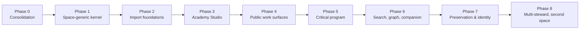

# 15 — Platform implementation plan

> The single execution document for building the intellectual platform defined in
> `14-INTELLECTUAL-PLATFORM.md`. Supersedes the roadmaps in docs 06 and 09 (which
> remain as history). Phases are gates, not dates: a phase is done when its
> acceptance gate passes, and `make verify` stays green throughout.
>
> **Status:** Proposed alongside ADR-0032.

---

## 0. Ground truth (verified 2026-09-02)

What exists in code — the baseline this plan builds on:

- **Orchestrator** (`backend/orchestrator/`): FastAPI, 17 migrations, twelve
  domains — `auth`, `canon`, `commerce`, `graph`, `join`, `knowledge`,
  `publication`, `readers`, `runs`, `sitecontent`, `support`, `twin`. OTP email
  auth with JWT session cookies. Postgres (pgvector) + Redis + MinIO via
  `docker-compose.orchestrator.yml`.
- **Frontend** (`frontend/`): entry `AppOptimized.tsx`; routes `/`, `/doctrine`,
  `/applied`, `/support`, `/join`, `/studio`, `/read/:ownerId/:slug`,
  `/book/digital-organism-theory`. Studio is functional (list, edit, save,
  publish). Book One reads from static manifests in `public/publications/`.
  `/academy` public IA exists as static frontend data (`academyData.ts`).
- **Quality:** zero type errors, 300+ tests, empty manifesto-law `QUARANTINE`,
  `make verify` is the gate.
- **Does not exist:** any `academy_*` table, the `academy` domain, claims,
  reviews, experiments, releases-with-manifests for Academy work, delivery
  builder, export bundles, multi-space anything. Attention-OS primitives P1,
  P3, P4, P5 are unimplemented (P2 Reader exists).

Two pre-existing launch obligations from doc 09 remain valid and run *parallel*
to this plan, not inside it: production deployment of what already works
(Gate A: public reading) and data-rights completion (export/delete/audit). This
plan is the Academy/platform track.

## 1. Phase map

Each phase lists scope, explicit non-scope, its acceptance gate, and the
manifesto laws / invariants it serves. Invariant references (P1–P14) are from
doc 14 §3.

---

## Phase 0 — Consolidation and doc truth *(this change)*

**Scope:** Docs 14 + 15 written; ADR-0032 proposed; README index and decision
log updated; superseded docs banner-marked. No code.

**Gate:** A new contributor can answer "what are we building and what is next?"
from docs 14 + 15 alone, without reading docs 04–13.

**Serves:** L8 (time well spent — one coherent record instead of eight partial ones).

## Phase 1 — Space-generic kernel ✅ **(shipped 2026-09-02)**

**Delivered:** migration `0018_academy_kernel` (16 tables, space-keyed, RLS with
membership-aware policies), `app/domains/academy/` (models, context binding +
fail-closed scope guard, authority policy, service, bootstrap), authoring +
delivery routes in `app/api/v1/academy.py`, `make seed-academy` (DOT Academy as
space row 1 with policy v1 and three programs), and the gate suites
`test_academy_kernel.py` + `test_academy_isolation.py`.

**Gate passed** (SQLite suites + live Postgres smoke): definition created →
revision frozen → claim annotated → draft invisible publicly → released with
manifest hash → fetched publicly → withdrawn to a tombstone; cross-space and
custodian access denied; second space provisioned with zero code changes.

**Scope as designed:**

- Migrations for `academy_spaces`, `academy_programs`, memberships, role grants,
  works, revisions, releases, claims + claim revisions, relations, source links,
  contributions, events, outbox (doc 14 §6). Every table space-keyed, RLS'd.
- `app/domains/academy/`: models, schemas, policy module, service, release
  validation. `app/api/v1/academy.py`: authoring + minimal delivery routes.
- Server-bound `app.academy_space_id` / `app.actor_id` transaction context
  derived from session + membership; never from client headers.
- Object-store namespaces for revisions and releases (write-once, hashed).
- Seed: DOT Academy space (row 1), its three programs, founder membership with
  steward/publisher grants under governance policy v1 (founder self-release,
  recorded honestly as policy — doc 13 §8.2).
- **Tests that are the point:** cross-space isolation (a second seeded test
  space cannot read/write the first); custody ≠ editorial authority; draft
  invisible through delivery routes; revision immutability; release state
  machine (`preparing → released | failed`, `released → withdrawn`).

**Not in scope:** review workflow, experiments, UI, search, exports.

**Gate:** Via API only — create a Definition in space 1, freeze a revision,
release it, fetch the immutable release publicly; drafts stay invisible; the
second-space isolation suite passes. **A second space is created by INSERT +
seed script, with zero code changes** (P14).

**Serves:** P1, P2, P9, P14; L9 (no profiling in any new table).

## Phase 2 — Import existing public foundations

**Scope:** Idempotent, re-runnable importers recording source hashes:

- `doctrineData.ts` → edition-bound Definition/claim works linked to Book One
  anchors (canon relations stay explicit — P5).
- `openSeams.ts` → Objection works targeting exact Book One claims.
- Homepage architecture diagram → first Diagram work with source + alt text.
- Static `academyData.ts` registry → program catalog projection.

Static sources are not deleted until output-parity tests pass (ADR-0005
discipline: deletion is its own later change).

**Gate:** Every imported object resolves to its current public URL and Book One
passage; migration introduces no independent claim; re-running the importer is
a no-op.

**Serves:** P4, P5; L1 (readers' existing links keep working).

## Phase 3 — Academy Studio

**Scope:** Extend the existing, working Studio patterns: create/edit workspace →
freeze revision → annotate material claims and levels → attach source anchors →
submit → inspect release validation → release → compare revisions. One work,
one transition at a time. No dashboards.

**Gate:** The founder takes one real work through the full lifecycle in the UI;
a second authorized steward can review a revision without receiving publisher
authority.

**Serves:** P1, P3, P4; L10 (single focus in the editorial surface).

## Phase 4 — Public work surfaces

**Scope:** Build the missing Field & Focus primitives under
`frontend/src/attention-os/focus/` (this finally implements P3 of the North
Star, per ADR-0016) and route the eight collections through one work renderer
with kind-specific sections: kind + boundary, work, claims at point of use,
provenance, strongest objections, version history, typed exits, explicit stop.

**Not in scope:** any recommendation, "related for you," or activity surface.

**Gate:** HTML, keyboard, screen-reader, print, JSON-LD, and export
representations carry the same identity, release, claim levels, and provenance;
`manifesto-laws.test.ts` and the e2e attention-laws suite stay green with the
new routes included.

**Serves:** P12, P13; L2, L3, L10, L11.

## Phase 5 — Critical program

**Scope:** Objection/response targeting rules (immutable targets only),
review assignments and reports, experiment protocol freeze / runs / artifacts,
outcome vocabulary. Open seams become the live objection register.

**Gate:** A response cannot alter its objection; a run cannot alter its frozen
protocol; a `not_supported` result remains equally discoverable in search and
graph (P6, P7 enforced by constraint + test, not convention).

**Serves:** P6, P7; L5 (no scoreboard of who "won" an argument).

## Phase 6 — Search, graph, and companion

**Scope:** Postgres full-text search with structured filters and mandatory
`reason` fields; bounded graph traversal (depth ≤ 2) with precomputed public
neighborhoods; twin retrieval over released material with authority-layer
labels (doc 14 §11). Ranking inputs and exclusions exactly per doc 13 §10.5.

**Gate:** Deleting all derived indexes and rebuilding changes no release hash
or citation; every search result and AI answer states why it appeared and what
layer it came from.

**Serves:** P8, P10; L9, L12; ADR-0014.

## Phase 7 — Preservation and external identity

**Scope:** RO-Crate-compatible release bundles, archive replication, fixity
scans, a documented restore drill, optional ORCID verification, external
identifier adapter (DataCite-compatible metadata).

**Gate:** A release bundle renders and validates in a clean environment with no
DOT database or application; a restore drill has actually been run.

**Serves:** P11; L7 (leaving — with the record — stays easy).

## Phase 8 — Multi-steward institution and second space

**Scope:** Versioned governance policy transitions (independent review,
two-person release, conflict disclosure, public review reports, term limits),
succession package automation, and — when a real second institution exists —
`/a/{space-slug}/` public mounting.

**Gate:** Removing the founder's active account orphans nothing: releases,
identifiers, governance history, and recovery all survive. A second real space
operates with independent governance and provably isolated authority.

**Serves:** P14; L7; ADR-0001 (the institution outlives its founder's accounts).

---

## 2. Standing rules for every phase

- `make verify` green before a phase is claimed; typecheck stays at zero errors.
- The `QUARANTINE` list in `manifesto-laws.test.ts` only shrinks.
- Every PR states which manifesto law it serves and violates none.
- New lasting trade-offs get an ADR before code.
- Docs 14/15 are updated in the same change that makes them stale.
- Founder decisions in doc 13 §23 (licensing, review policy, reviewer identity,
  resolution authority, contributor boundary, archival partner) must be answered
  before Phase 5 releases anything from a non-founder contributor.
