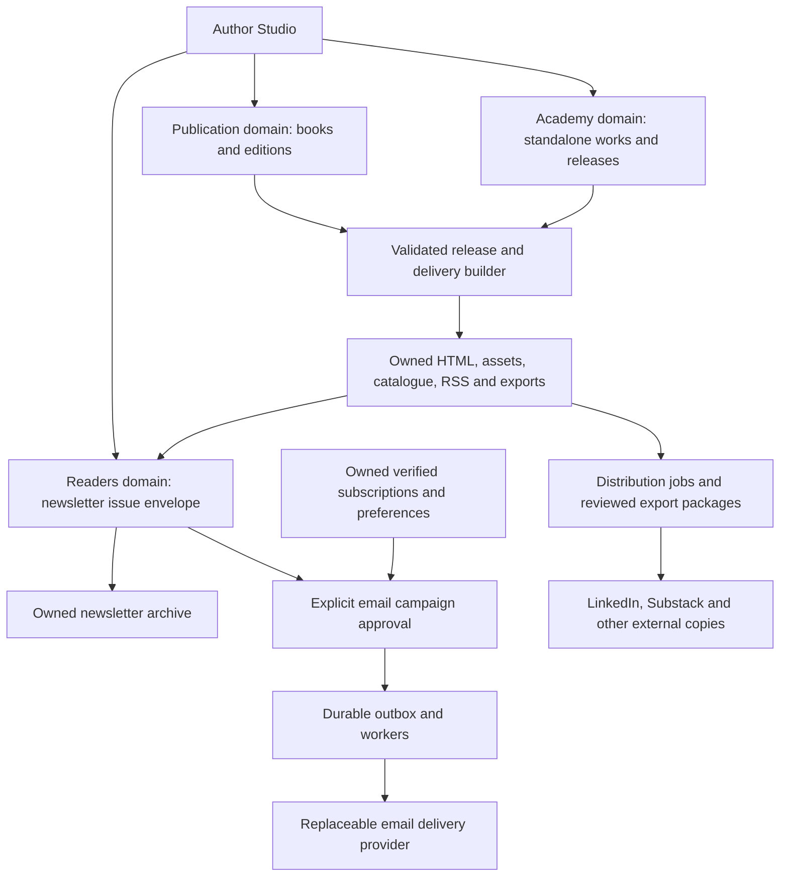

# 16 - Owned publication platform

> **Status: Proposed specification, 2026-10-05.** Not a claim of shipped
> functionality. Extends docs 14/15 through ADR-0039; accepted ADRs still win.
> Founder intent: this website is the publication platform, not a directory
> sending readers elsewhere. The Millennial Manifesto is a separate book applying
> DOT to the author's analysis of the world and environment he inhabits.

## 1. Product contract

Publish and read complete books, essays, analysis, letters, and newsletter issues
here. A visitor needs neither LinkedIn, Substack, nor a site account to read a
public release. Email is an optional delivery method; external platforms are
optional discovery and distribution channels. The site owns the editorial
record, addresses, consent, archive, and export path.

Three distinct objects must not collapse:

- **Book:** an ordered manuscript released as a fixed edition. Book One and The
  Millennial Manifesto are separate projects, not automatically Book One/Two.
- **Standalone writing:** an independently released essay, analysis, or letter.
  Applying DOT does not make an author's interpretation part of Book One's canon.
- **Newsletter:** a named series of finite, archived issues. An issue can carry a
  complete letter or a digest of existing releases. Sending it is not publishing it.

The same work may appear in a newsletter and later inform a book. Those are typed
relationships to exact versions, not automatic copying into the book manuscript.
AI must not invent the author's prose, sources, or claim classifications.

## 2. Verified baseline and gaps

Inspected on 2026-10-05:

| Capability | Exists | Required next |
| --- | --- | --- |
| Book reader | Static Book One manifests and full reading surface | Catalogue and a distinct applied-book project |
| Essay reader | `/essays`, `/essays/:slug`, validated Markdown, build-time HTML and RSS | Real author-supplied essays; native Studio release path |
| Authoring | Publication project/section/revision/release API and Studio; Academy immutable revisions/releases/projections | Unified editorial entry with domain-specific actions |
| Reader list | Sealed addresses, confirmation, unsubscribe, availability guard | Newsletter preferences, issue delivery and durable send workflow |
| Confirmation mail | Auth service calls Resend; reader service reuses it | Dedicated mail transport abstraction, production verification |
| External writing | Newsletter metadata and one LinkedIn edition link | Author-supplied/imported full text with provenance |
| Distribution | No outbound syndication workflow in the inspected paths | Manual export/recording first; supported adapters later |

Code anchors: `frontend/scripts/essays.mjs`,
`frontend/scripts/materialize-public-routes.mjs`,
`backend/orchestrator/app/domains/publication/service.py`,
`backend/orchestrator/app/domains/academy/models.py`,
`backend/orchestrator/app/domains/readers/service.py`, and
`backend/orchestrator/app/domains/auth/service.py`.

An external URL is not a hosted article. Availability checks in development do
not prove production mail, storage, backups, or authoring are ready. The existing
publication service commits synchronous release snapshots; the durable release
workflow below is a target, not its current implementation.

## 3. Architecture decision

Extend the existing **modular FastAPI orchestrator**, Postgres, object store,
Redis/Dramatiq workers, React reader, and static delivery pipeline. Do not add a
second CMS, a new microservice, or a parallel content database for this milestone.

### Ownership boundaries

| Owner | Owns | Must not become |
| --- | --- | --- |
| `publication` | Book projects, chapter drafts, revisions, fixed edition manifests | A newsletter subscriber database |
| `academy` | Essays, analysis and letters using existing `essay` kind and release contracts | An alternative book manuscript engine |
| `readers` | Series, preferences, issue envelopes, campaign lifecycle, recipient eligibility | A new editorial revision engine or membership system |
| `runs` and workers | Durable publishing/distribution work and attempt state | Authority to publish without an author-approved action |
| `connectors` | Platform capabilities, distribution jobs and external-copy records | The authoritative store of writing or reader addresses |
| Delivery builder | Rebuildable public catalogue, HTML, RSS and export packages | A public query over draft tables |

The connector module is proposed; it need not be a new deployed service. Reuse
scoped release events/outbox contracts without assuming the two domains already
share an atomic release implementation. The graph may project external-copy
relationships; deleting it cannot delete releases or distribution history.

## 4. Public information architecture

Proposed routes; existing URLs remain valid:

| Address | Purpose |
| --- | --- |
| `/publications` | Finite catalogue of books, writing collections and newsletter series |
| `/book/digital-organism-theory` | Existing Book One reader, unchanged |
| `/book/the-millennial-manifesto` | Separate applied-book landing and released edition reader |
| `/essays`, `/essays/:slug` | Standalone essays, analysis and letters |
| `/newsletters`, `/newsletters/:seriesSlug` | Series descriptions and bounded issue archives |
| `/newsletters/:seriesSlug/:issueSlug` | Complete native issue, explicit ending, publication provenance |
| `/readers` | Open, verified subscription and newsletter preferences, not membership |
| `/feed.xml` | Preserve existing essay feed semantics |
| `/newsletters/:seriesSlug/feed.xml` | Issue feed; no subscription or tracking required |

Each release also has an immutable version URL below its public address, using
the release number, and a machine-readable manifest. Existing links continue to
resolve; a slug change creates a redirect, never reuses a withdrawn identity.
An in-development book page is not a fabricated manuscript or a finished reader.

Show title, author, original publication date, local release date, correction
date, format, and provenance where applicable. Do not claim a LinkedIn original
was first published here. Chronological archives use explicit pagination with an
end, never infinite scroll or engagement ranking. Navigation exposes Publications
without turning the theory-led homepage into a marketing page.

Reuse P2 Reader and existing P3 FocusNav where suitable; verify live primitives
before claiming composition. Every released page has matching HTML without
JavaScript, metadata, canonical URL, sitemap entry, keyboard navigation, print
output, and locally hosted licensed assets. No external tracking embeds.

## 5. Author Studio and release lifecycle

One authoring entry, with book, standalone work, and newsletter modes. Reuse
existing editor/reader patterns, not an analytics dashboard. Keep draft, preview,
release, email, and external distribution as distinct commands and permissions.

1. Create or import a private draft; declare ownership and provenance.
2. Edit text, sections, citations, claim levels and licensed assets.
3. Freeze a revision. Review web, print/export and newsletter renderings.
4. Validate ownership, release authority, references, claim levels, accessibility
   and content hashes. Do not make the AI the classifier or publisher.
5. Build content-addressed artifacts; validate them before atomically advancing
   the public delivery projection. Failed preparation leaves the prior release live.
6. Record an immutable release and update the stable latest alias. Publication
   success does not depend on email or external-platform availability.
7. Separately approve a newsletter campaign or reviewed distribution package.

Corrections create a new release; delivered email cannot be edited retroactively.
Withdrawals have a reason and tombstone, with cache invalidation. Sensitive/legal
takedowns can restrict the old body while retaining minimum lawful metadata;
ordinary corrections retain history. Public artifacts never include drafts or
secrets. Private drafts must not enter a public Git repository.

The current static essay path remains a first-release bridge. Importers preserve
slug, dates, text hash and origin; parity tests precede cutover. Do not leave two
editable sources for the same work. Book One's existing reader is not migrated
as a side effect of implementing newsletters.

## 6. Proposed data contracts

Names below are target migration contracts, not existing tables:

- `newsletter_series`: owner, slug, title, description, cadence statement, state.
- `newsletter_issues`: series, stable slug, issue identity and lifecycle state.
- `newsletter_issue_releases`: immutable ordered list of exact public release
  references, manifest/hash, release number and timestamps. A complete original
  letter is an Academy `essay` release, not mutable text hidden in a campaign.
- `reader_newsletter_preferences`: subscription, series, explicit opt-in state,
  consent version/source/time and opt-out time. Do not silently subscribe the
  existing general reader list to every new series.
- `newsletter_campaigns`: exact issue release, author approval, schedule, timezone,
  payload hash, delivery state and stable idempotency identity.
- `newsletter_deliveries`: campaign, subscription identity, attempt state,
  provider message identity, bounded error codes and reconciliation timestamps.
  Unique `(campaign_id, subscription_id)`; no opens, clicks or engagement scores.
- `distribution_jobs`: exact native release, platform, reviewed mode
  (`excerpt`, `full_copy`, `link`), approval, payload hash and job state.
- `external_publication_copies`: job, exact native source release, external URL,
  original publication provenance, copy state and verified timestamp.
- `publication_catalogue_projection`: typed native release references and
  display metadata; public-released objects only, no second copy of draft bodies.

Use concrete foreign keys or checked association tables for publication and
Academy references, enforcing exactly one authority target and matching scope.
Newsletter envelopes accept only validated public releases initially. Catalogue
rows are rebuildable. Keep sealed subscriber addresses in the existing store;
delivery jobs reference IDs rather than copying addresses into queues or logs.

## 7. Native newsletter and email contract

**Publish on site first; send only on an explicit author action.** An issue can
exist without a campaign. A campaign always references one frozen issue release.
Readers explicitly choose a series and whether they want mail. No signup popup,
forced account, hidden membership application, or automatic re-engagement mail.

Retain ADR-0025: double opt-in, sealed addresses, no public counts, one-click
unsubscribe without an account, no pixels, rewritten tracking links, behavioral
segmentation, or subscriber-list export to Substack/LinkedIn. Provide separate
series preferences and a clearly labeled leave-all action. The unsubscribe
endpoint must accept applicable email-standard one-click requests as well as
the site's fragment-token flow; it must not depend on browser JavaScript alone.
Store token hashes; issue tokens when needed and never log their plaintext.

Extend the existing Resend transport first, behind a narrow replaceable adapter.
Use it only to deliver individual approved messages, not to own contacts or run
marketing automation. The provider necessarily sees each recipient and payload;
state that honestly in privacy documentation and vet retention, processing terms
and tracking controls before production activation. Provider access is not blind.

Required production gates: authenticated sending domain, SPF/DKIM/DMARC checks,
monitored reply address, working confirmation, compliant sender/footer information,
plain-text and HTML versions, List-Unsubscribe/one-click headers, size limits,
tracking disabled and verified in delivered messages, and signed/replay-protected
bounce/complaint callbacks. Provider-specific support must be demonstrated rather
than assumed. Suppression applies to later newsletter mail without accidentally
disabling unrelated account-security mail.

### Durable delivery

- Campaign states: `draft -> scheduled -> sending -> completed | partial | failed`;
  cancel before dispatch and cancel remaining queued recipients during sending.
- Persist approval/outbox transactionally. At dispatch, recheck confirmed status,
  series consent, withdrawal, suppression and cancellation. Newly joined readers
  do not silently receive old issues; replay requires separate author approval.
- Use a unique delivery row and stable provider idempotency key. Limit retries
  to the verified provider deduplication window; reconcile ambiguous accepts or
  require manual review rather than blindly sending duplicates. Do not promise
  exactly-once SMTP delivery.
- Unsubscribe blocks future undispatched sends. A message already accepted by
  the provider cannot be recalled; describe this transport boundary honestly.
- Accept only operational delivery/bounce/complaint events, not open/click events.
  Retain bounded operational metadata for a documented period, then erase it.
- Cancellation and provider outage never unpublish the issue. Export includes
  content and the reader's own consent data; deletion removes address material
  and pending work while retaining only justified, minimized suppression/audit data.

## 8. Distribution integrations

Start with **reviewed export and manual publication**, not unsupported automation.
One native release produces reusable plain text/HTML, licensed image assets,
title, summary, native URL, citation metadata and an optional author-reviewed
excerpt. Posting records an external-copy relationship, not a second authority.

| Platform | Initial integration | Later automation gate |
| --- | --- | --- |
| LinkedIn | Native introduction/excerpt or selected full article; author posts and records URL | Verify API product, permissions and article/newsletter support for this account; ordinary post/video support is not evidence |
| Substack | Separate external publication for discovery; reviewed excerpt/full copy with native-source link, manual export/import | Verify supported public API/feed capabilities and account terms; RSS import is not a promise of ongoing syndication |
| Other platforms | Reviewed export packages and ordinary links | Capability-specific API adapter with scoped credentials and revocation |

Default to excerpts pointing to the complete owned text. Allow full cross-posts
as an explicit editorial decision. Configure an external canonical URL only where
the platform actually supports it; an ordinary source link is not an SEO
canonical declaration. Search engines may choose a different canonical anyway.

No credentials in the client, Git, logs or browser storage. OAuth callbacks require
state/PKCE as appropriate; encrypt server-side tokens and request minimum scopes.
Imports need author rights, explicit scope, safe asset fetching/SSRF protection,
HTML sanitization and source checksums. No login-wall bypass or private scraping.
URL-only records stay external references until full text is supplied and released.

An external Substack audience is separate: readers choose that relationship on
Substack. Do not sync the owned list in either direction without new specific
consent and a superseding decision where ADR-0025 forbids the proposed transfer.
Do not embed external feeds, signup trackers, badges or counters on this site.
External edit/delete failures remain visible to the author; they cannot silently
modify the source release or promise that an external copy has been removed.

## 9. Proposed API responsibilities

Keep existing book, Academy, reader subscribe/confirm/unsubscribe APIs. New endpoint
names are proposed and require an implementation review before becoming public:

| Surface | Contract |
| --- | --- |
| Public delivery | Paginated catalogue, series/issue manifests, exact releases, safe latest aliases, RSS |
| Authoring | Create series/issue, select exact releases, preview, validate and release envelope |
| Reader preferences | Confirmed consent update and leave-series/leave-all; no arbitrary subscriber lookup |
| Campaign commands | Preview/test to verified author, approve, schedule, cancel, inspect operational status |
| Distribution commands | Prepare reviewed package, approve job, record external URL, reconcile or revoke adapter |
| Provider callbacks | Authenticate signature, reject replay, normalize bounded operational events |

All commands validate ownership/space, authority, allowed states, size and URLs
server-side. Request idempotency includes the actor, scope and exact payload hash.
Public APIs never accept an owner header as evidence of editorial authority.

## 10. Implementation slices and acceptance gates

These are a bounded publication track alongside doc 15, not a requirement to
finish all Academy phases before the author can publish.

| Slice | Deliverable | Acceptance gate |
| --- | --- | --- |
| A - Owned text | Author-supplied first essay/letter released through the existing static path; Publications catalogue and applied-book project page | Entire article readable here without LinkedIn, login or JS; no fake/sample prose; provenance and source links preserved |
| B - Native editorial loop | Production-safe Studio -> immutable work/book release -> owned delivery; idempotent static import | One real work released end to end; draft inaccessible; old URL/hash preserved; storage failure leaves previous release available |
| C - Newsletter archive | Series, complete issue releases, previews, series RSS and preferences | Full issue readable here before any email; no duplicate editable manuscript; only exact public release references |
| D - Email delivery | Verified transport, explicit campaign approval, outbox, suppression, leave and deletion | Confirm -> receive approved issue -> unsubscribe -> next send skipped; timeout/cancel/duplicate webhook tested; no tracking payload |
| E - Distribution | Reviewed LinkedIn/Substack package and recorded external copies | Same source release/hash retained; external failure does not affect native release; no subscriber export or unverified API promise |
| F - Preservation | Content/consent exports, restore drill, eventual PDF/EPUB improvements | Restore released writing and archive on a clean system without the original app or provider |

A is useful without email or connectors. D and E are independent after C/B;
do not delay native reading until both are available. Import the author's existing
articles with permission and full text; the current LinkedIn link alone cannot
satisfy A. Before A, resolve the currently failing diagram-geometry test so the
required repository gate is green; that failure is not a publication feature.

## 11. Verification and launch requirements

- Tests: immutable releases, scoped authority, draft exclusion, exactly-one source
  reference, archive pagination, canonical/provenance parity, import idempotency,
  scheduled-send consent recheck, retry ambiguity, signed callbacks and deletion.
- Browser: desktop/mobile, keyboard/screen reader, reduced motion, Reader controls,
  long titles, readable tables/footnotes, complete text without JS and clean endings.
- Security: sealed contacts/tokens, source rights, import sanitization, SSRF limits,
  rate limits, redacted logs and no sensitive data in public artifacts.
- Operations: durable production database/object storage, encrypted backups and
  restore drill, bounded worker retry queues, provider outage/cancellation drill.
- Gates: `make verify`, focused publication/reader e2e and mail integration tests.
  Documentation-only validation checks local links and declared states; it does
  not prove runtime delivery, external APIs or production readiness.

## 12. Explicit exclusions and founder decisions

No Ghost/WordPress replacement, payment gate, engagement dashboard, public metrics,
ranked feed, auto-next, notification system, multi-author expansion or automatic
social posting in the first increment. No promise that Substack will bring readers.

Founder decisions before implementation: approve ADR-0039; confirm the applied
book's working title and newsletter title relationship; supply the first article
text; choose full-letter versus digest delivery and an honest cadence; approve
the verified email processor and its privacy terms. Provider signup, production
credentials, DNS changes and external account actions require explicit authorization.

Serves L1 (legible state), L2 (finite reading), L3 (sought archives), L4 (reader-chosen
mail, not unsolicited interruptions), L7 (leave/export/delete), L9 (no profiling),
L10 (focused reading/authoring), and L12 (explicit reader/author intent). Violates
none; incompatible external tracking/list transfers require a superseding ADR,
not a quiet integration. ADR-0025 remains unchanged.